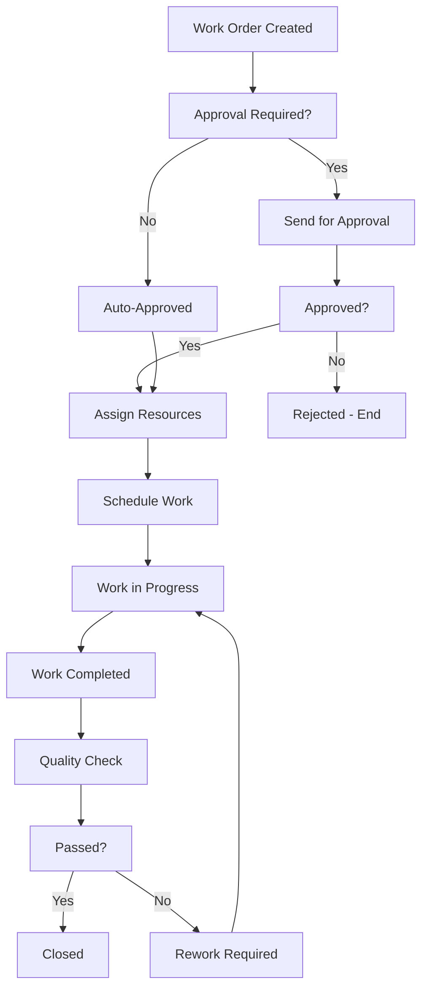
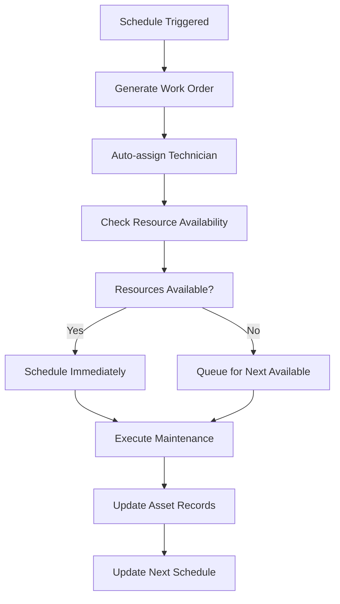
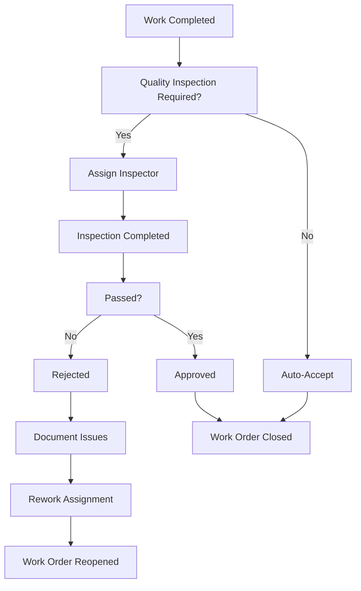

# Maintenance Management Module Documentation

## Overview

The Maintenance Management module is a comprehensive solution for managing assets, work orders, maintenance schedules, technicians, contractors, quality control, and related operations within the ERP system. It provides full lifecycle management of maintenance activities with enhanced workflows, analytics, and mobile support.

## Key Features

### 1. Asset Management
- **Asset Hierarchy**: Support for parent-child relationships between assets
- **Multi-Type Assets**: Vehicles, Buildings, Equipment with specialized fields
- **Asset Categories**: Configurable categories with maintenance schedules
- **Asset Tracking**: Location, operating hours, mileage, specifications
- **Warranty Management**: Track warranty periods and providers
- **Document Management**: Store manuals, certificates, and images

### 2. Work Order Management
- **Complete Lifecycle**: From creation to completion with approval workflows
- **Task Management**: Break down work orders into manageable tasks
- **Resource Planning**: Parts, labor, and contractor assignments
- **Cost Tracking**: Estimated vs actual costs and hours
- **Safety Requirements**: Permits, lockout procedures, confined space entry
- **Document Attachments**: Photos, reports, and certificates

### 3. Maintenance Scheduling
- **Multi-Criteria Scheduling**: Time-based, usage-based, condition-based
- **Preventive Maintenance**: Automatic work order generation
- **Calendar Integration**: Schedule optimization and conflict resolution
- **Recurring Schedules**: Support for complex recurring patterns
- **Condition Monitoring**: IoT integration for predictive maintenance

### 4. Technician Management
- **Skill Management**: Track certifications and competencies
- **Team Organization**: Flexible team structures and assignments
- **Scheduling**: Availability, workload balancing, and optimization
- **Performance Tracking**: KPIs and productivity metrics
- **Training Records**: Certification tracking and renewal management

### 5. Contractor Management
- **Contractor Database**: Comprehensive vendor information
- **Performance Evaluation**: Rating systems and history tracking
- **Work Order Integration**: Seamless contractor assignments
- **Cost Management**: Rate tracking and invoice processing
- **Compliance Monitoring**: Insurance, certifications, and safety records

### 6. Quality Control
- **Inspection Workflows**: Multi-level sign-off processes
- **Quality Standards**: Configurable checklists and criteria
- **Rejection Management**: Rework tracking and resolution
- **Compliance Monitoring**: Safety and regulatory compliance
- **Audit Trails**: Complete history of quality decisions

### 7. Mobile Maintenance
- **Field Support**: Mobile-optimized interfaces for technicians
- **Offline Capability**: Work in areas with limited connectivity
- **Photo Documentation**: Capture and attach photos directly
- **GPS Integration**: Location-based asset identification
- **Barcode/QR Scanning**: Quick asset and parts identification

### 8. Advanced Analytics
- **Performance Dashboards**: Real-time KPI monitoring
- **Predictive Analytics**: Failure prediction and optimization
- **Cost Analysis**: Maintenance cost trends and optimization
- **Asset Utilization**: Usage patterns and efficiency metrics
- **Technician Performance**: Productivity and quality metrics

### 9. IoT Integration
- **Sensor Data**: Real-time monitoring of asset conditions
- **Predictive Maintenance**: AI-driven maintenance scheduling
- **Alerts and Notifications**: Automated condition-based alerts
- **Data Analytics**: Historical trend analysis and reporting

### 10. Workflow Engine Integration
- **Approval Processes**: Configurable multi-level approvals
- **Escalation Management**: Automatic escalation on delays
- **Notification System**: Email, SMS, and in-app notifications
- **Audit Compliance**: Complete workflow audit trails

## Architecture

### Entity Structure

#### Core Entities
- **MaintenanceAsset**: Central asset management entity
- **WorkOrder**: Work order lifecycle management
- **MaintenanceSchedule**: Schedule management and automation
- **TechnicianTeam**: Team organization and management
- **MaintenanceContractor**: Contractor information and performance

#### Supporting Entities
- **AssetType**: Configurable asset type definitions
- **WorkOrderType**: Work order categorization
- **MaintenanceType**: Maintenance activity classification
- **PriorityLevel**: Configurable priority management
- **TechnicalSkill**: Skill and certification tracking

#### Quality Control
- **QualityInspection**: Inspection workflow management
- **ComplianceStandard**: Regulatory compliance tracking
- **SafetyProtocol**: Safety procedure enforcement

#### Analytics and Reporting
- **MaintenanceMetrics**: KPI calculation and storage
- **AssetPerformance**: Asset-specific performance tracking
- **CostAnalysis**: Maintenance cost analysis
- **PredictiveModels**: AI/ML model integration

### Service Layer

#### Core Services
- **WorkOrderService**: Complete work order lifecycle management
- **MaintenanceScheduleService**: Schedule automation and optimization
- **TechnicianService**: Technician management and optimization
- **ContractorService**: Contractor workflow management
- **QualityControlService**: Quality assurance workflows

#### Advanced Services
- **MaintenanceAnalyticsService**: Performance analytics and reporting
- **PredictiveMaintenanceService**: AI-driven predictive analytics
- **IoTMaintenanceService**: IoT sensor integration
- **MobileMaintenanceService**: Mobile application support
- **WorkflowIntegrationService**: Workflow engine integration

#### Notification Services
- **MaintenanceNotificationService**: Comprehensive notification management
- **EscalationService**: Automatic escalation handling
- **ReportingService**: Automated report generation

### Data Access Layer

#### Repositories
- **GenericRepository<T>**: Base repository with common operations
- **MaintenanceRepository**: Maintenance-specific data access
- **TechnicianSkillAssignmentRepository**: Skill management data access
- **ContractorPerformanceRepository**: Contractor performance tracking

#### Database Configuration
- **Entity Configurations**: Proper foreign key relationships and indexes
- **Migration Support**: Database schema evolution
- **Multi-tenancy**: Tenant isolation and data security

## Key Workflows

### 1. Work Order Lifecycle

### 2. Preventive Maintenance Flow

### 3. Quality Control Process

## Configuration

### Asset Type Configuration
- Define asset-specific fields and requirements
- Configure maintenance intervals and procedures
- Set up specialized tracking (mileage, operating hours, etc.)
- Define safety and compliance requirements

### Maintenance Schedule Configuration
- Time-based schedules (daily, weekly, monthly, etc.)
- Usage-based schedules (miles, hours, cycles)
- Condition-based schedules (sensor thresholds)
- Multi-criteria schedules (combination of above)

### Workflow Configuration
- Approval hierarchies and escalation rules
- Notification preferences and timing
- Quality control checkpoints
- Document requirements

## API Endpoints

### Work Orders
- `GET /api/workorders` - List work orders
- `POST /api/workorders` - Create work order
- `PUT /api/workorders/{id}` - Update work order
- `DELETE /api/workorders/{id}` - Delete work order
- `POST /api/workorders/{id}/approve` - Approve work order
- `POST /api/workorders/{id}/assign` - Assign resources

### Assets
- `GET /api/assets` - List assets
- `POST /api/assets` - Create asset
- `PUT /api/assets/{id}` - Update asset
- `GET /api/assets/{id}/maintenance-history` - Get maintenance history
- `GET /api/assets/{id}/performance` - Get performance metrics

### Technicians
- `GET /api/technicians` - List technicians
- `POST /api/technicians` - Create technician
- `GET /api/technicians/{id}/schedule` - Get technician schedule
- `POST /api/technicians/{id}/skills` - Update skills

### Schedules
- `GET /api/schedules` - List maintenance schedules
- `POST /api/schedules` - Create schedule
- `PUT /api/schedules/{id}` - Update schedule
- `POST /api/schedules/{id}/execute` - Manual schedule execution

### Analytics
- `GET /api/analytics/dashboard` - Main dashboard data
- `GET /api/analytics/assets/{id}/performance` - Asset performance
- `GET /api/analytics/technicians/{id}/kpis` - Technician KPIs
- `GET /api/analytics/costs` - Cost analysis

## Mobile Support

### Features
- Offline work order management
- Photo and document capture
- GPS-based asset location
- Barcode/QR code scanning
- Real-time synchronization
- Push notifications

### API Endpoints
- `GET /api/mobile/workorders/{technicianId}` - Technician work orders
- `POST /api/mobile/workorders/{id}/update` - Update work order status
- `POST /api/mobile/workorders/{id}/photos` - Upload photos
- `POST /api/mobile/sync` - Synchronize offline data

## Security and Permissions

### Role-Based Access Control
- **Maintenance Manager**: Full access to all features
- **Supervisor**: Team management and work order approval
- **Technician**: Work order execution and updates
- **Contractor**: Limited access to assigned work orders
- **Quality Inspector**: Quality control workflows

### Data Security
- Tenant-based data isolation
- Encrypted sensitive data
- Audit trails for all changes
- Role-based field visibility

## Performance Considerations

### Database Optimization
- Proper indexing on frequently queried fields
- Partitioning for large historical data
- Query optimization for complex reports
- Caching for frequently accessed data

### Scalability
- Horizontal scaling support
- Asynchronous processing for heavy operations
- Background job processing for schedules
- Event-driven architecture for notifications

## Integration Points

### External Systems
- **ERP Integration**: Financial data, inventory, purchasing
- **IoT Platforms**: Sensor data and condition monitoring
- **GIS Systems**: Location-based asset management
- **Document Management**: Technical manuals and procedures
- **Email/SMS**: Notification delivery
- **Mobile Applications**: Field technician support

### Data Exchange
- RESTful APIs for real-time integration
- Webhook support for event notifications
- Bulk data import/export capabilities
- Standard data formats (JSON, XML, CSV)

## Reporting and Analytics

### Standard Reports
- Work Order Status Report
- Asset Performance Report
- Technician Productivity Report
- Maintenance Cost Analysis
- Compliance Status Report
- Contractor Performance Report

### Dashboard Widgets
- Open Work Orders by Priority
- Asset Downtime Summary
- Technician Workload
- Maintenance Cost Trends
- Upcoming Scheduled Maintenance
- Quality Metrics

### Key Performance Indicators (KPIs)
- **Asset Availability**: Uptime percentage
- **Mean Time to Repair (MTTR)**: Average repair time
- **Mean Time Between Failures (MTBF)**: Reliability metric
- **Maintenance Cost per Asset**: Cost efficiency
- **Schedule Compliance**: Preventive maintenance adherence
- **Technician Utilization**: Resource efficiency
- **Quality Score**: Work quality metrics

## Deployment and Maintenance

### Database Migrations
- Entity Framework Core migrations
- Data seeding for initial configuration
- Version control for schema changes
- Rollback procedures

### Configuration Management
- Environment-specific settings
- Feature flags for gradual rollout
- External configuration for schedules
- Runtime configuration updates

### Monitoring and Logging
- Application performance monitoring
- Error tracking and alerting
- User activity logging
- System health dashboards

## Best Practices

### Development
- Follow SOLID principles
- Implement proper error handling
- Use async/await patterns
- Write comprehensive unit tests
- Document API endpoints

### Data Management
- Regular database backups
- Archive old maintenance records
- Monitor database performance
- Optimize queries regularly

### User Experience
- Responsive design for all devices
- Intuitive navigation and workflows
- Comprehensive search capabilities
- Real-time updates and notifications
- Accessibility compliance

## Troubleshooting

### Common Issues
- **Schedule Not Executing**: Check background job service status
- **Notifications Not Sent**: Verify email/SMS configuration
- **Mobile Sync Issues**: Check network connectivity and API status
- **Performance Issues**: Review database indexes and query plans
- **Permission Errors**: Verify role assignments and permissions

### Debugging Tools
- Application logs and error tracking
- Database query profiling
- API endpoint monitoring
- Mobile application debugging
- Workflow execution tracking

## Future Enhancements

### Planned Features
- **Augmented Reality (AR)**: Visual asset identification and instructions
- **Machine Learning**: Advanced predictive maintenance models
- **Blockchain**: Immutable maintenance records
- **Advanced IoT**: Edge computing and real-time processing
- **Voice Commands**: Voice-activated mobile operations
- **3D Asset Models**: Interactive 3D asset visualization

### Technology Roadmap
- Migration to newer .NET versions
- GraphQL API implementation
- Microservices architecture
- Container orchestration with Kubernetes
- Cloud-native deployment options

This comprehensive documentation provides complete guidance for implementing, using, and maintaining the Maintenance Management module within the ERP system. The module is designed to be scalable, maintainable, and user-friendly while providing enterprise-grade features for complex maintenance operations.