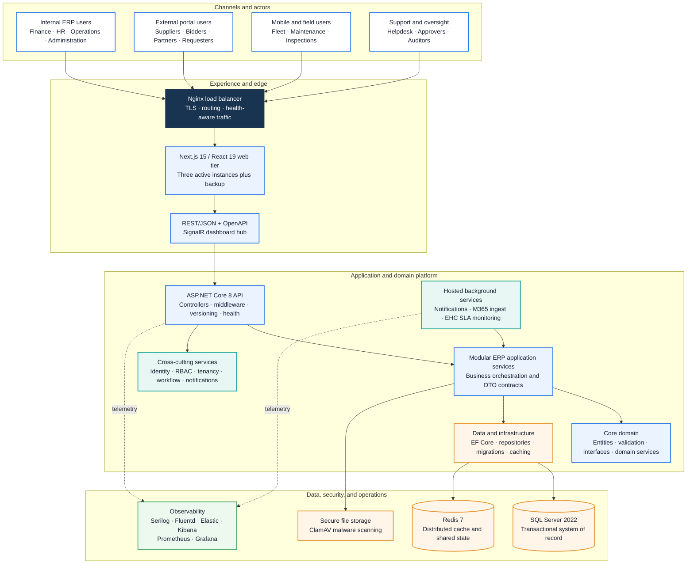

# RHEMA ERP Architecture Diagrams

These diagrams are stored as text-based Mermaid definitions so they can be reviewed in pull requests and rendered directly by GitHub. On GitHub, open this file to view the diagrams. To export PNG or SVG, copy a Mermaid block into [Mermaid Live](https://mermaid.live/) and choose **Actions → Export**.

## Solution architecture

## Capability and integration map

```mermaid
flowchart TB
    classDef platform fill:#183451,stroke:#183451,color:#ffffff,stroke-width:3px
    classDef domain fill:#ffffff,stroke:#2778e8,color:#172033,stroke-width:2px
    classDef foundation fill:#eef4f9,stroke:#7890a8,color:#172033

    Platform([Shared ERP platform<br/>Identity and RBAC · Tenant isolation · Workflow engine<br/>Notifications · Document numbering · Reporting<br/>Audit trail · SignalR])

    Finance[Finance and accounting<br/>GL · AP/AR · bank and cash · budgets<br/>tax · fixed assets · reporting]
    Procurement[Procurement<br/>Planning · requisitions · RFQs · tenders<br/>purchase orders · contracts · suppliers]
    HR[HR and payroll<br/>Employees · organization · positions<br/>leave · benefits · payroll]
    Operations[Inventory and maintenance<br/>Warehouses · stock movements · fleet<br/>assets · work orders · inspections]
    Estate[Estate and facilities<br/>Land · property · facilities · permits<br/>GIS views · service delivery]
    Projects[Projects and planning<br/>Portfolios · programs · resources<br/>timelines · expenses · billing]
    Sales[Sales, CRM, and pricing<br/>Customers · partners · campaigns<br/>agreements · products · price lists]
    Support[Documents and helpdesk<br/>Records · secure attachments · knowledge base<br/>tickets · complaints · enquiries · SLAs]

    SQL[(SQL Server<br/>System of record)]
    Redis[(Redis<br/>Cache and distributed state)]
    Files[Secure files<br/>ClamAV protected]
    Ops[Operations<br/>Metrics · logs · health]
    Channels[External channels<br/>Partner portal · email · mobile]

    Finance --- Platform
    Procurement --- Platform
    HR --- Platform
    Operations --- Platform
    Estate --- Platform
    Projects --- Platform
    Sales --- Platform
    Support --- Platform

    Platform --> SQL
    Platform --> Redis
    Platform --> Files
    Platform -.-> Ops
    Channels --> Platform

    class Platform platform
    class Finance,Procurement,HR,Operations,Estate,Projects,Sales,Support domain
    class SQL,Redis,Files,Ops,Channels foundation
```

