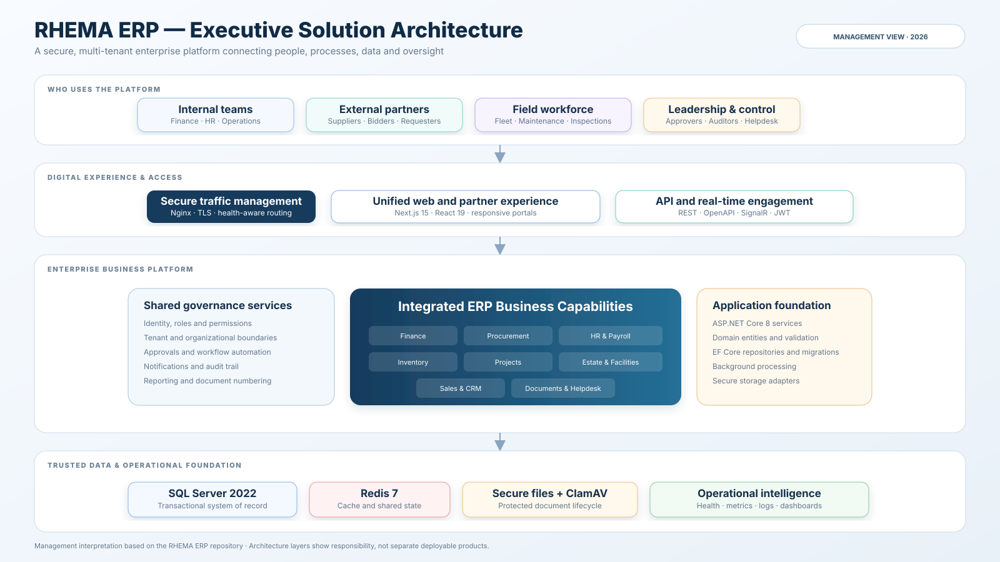
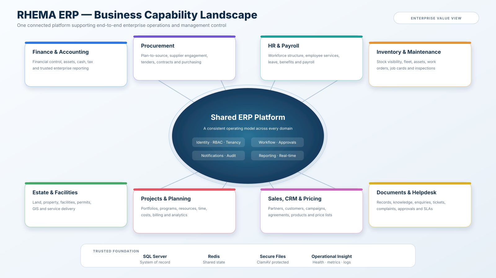

# RHEMA ERP Management Architecture

These management-ready visuals summarize the repository-derived solution architecture and business capability landscape. They are native SVG assets: GitHub displays them as images, browsers can download them directly, and presentation software can place them without losing quality.

## Executive solution architecture

[Open or download the executive solution architecture SVG](assets/rhema-erp-executive-architecture.svg)

This view explains how internal teams, external partners, field users, and leadership access a shared ERP platform through secure digital channels. It emphasizes governance, integrated business capabilities, trusted data, secure files, and operational intelligence rather than implementation-level call flows.

## Business capability landscape

[Open or download the business capability landscape SVG](assets/rhema-erp-capability-landscape.svg)

This view is designed for management discussions: eight enterprise capability groups surround the shared controls and technology foundation that connect them.

## Presentation guidance

- Use the **executive solution architecture** when discussing technology strategy, security, resilience, or investment.
- Use the **business capability landscape** when discussing ownership, transformation scope, operating model, or roadmap priorities.
- Download the SVG directly from GitHub for PowerPoint, Google Slides, or a design tool. Most browsers can also print or export an opened SVG as PDF or PNG.
