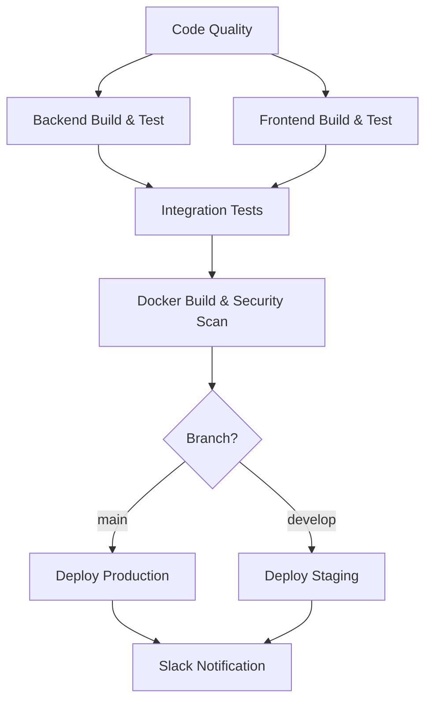
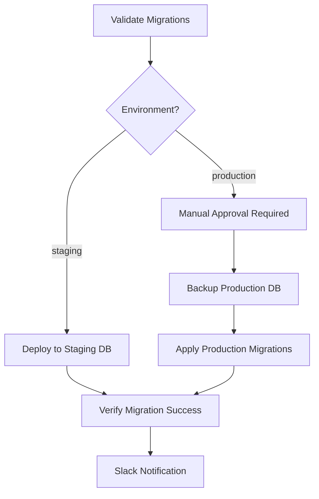
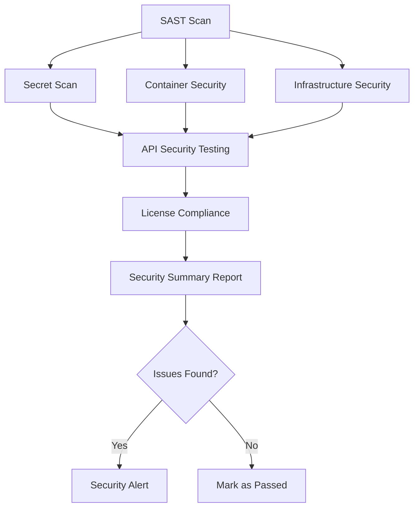

# ERP System - CI/CD Pipeline Documentation

## 🚀 **CI/CD Overview**

Our ERP system now includes a robust CI/CD pipeline with GitHub Actions that provides:

- ✅ **Automated Testing**: Unit, integration, and E2E tests
- ✅ **Code Quality**: Static analysis, security scanning, and linting
- ✅ **Security**: Vulnerability scanning and secret detection
- ✅ **Performance**: Load testing and performance monitoring
- ✅ **Database**: Automated migrations with approval gates
- ✅ **Multi-Environment**: Staging and production deployments
- ✅ **Monitoring**: Slack notifications and comprehensive reporting

## 📁 **Workflow Files Structure**

```
.github/workflows/
├── ci-cd.yml                    # Main CI/CD pipeline
├── database-migrations.yml      # Database migration automation
├── security-scan.yml           # Security vulnerability scanning
└── performance-testing.yml     # Performance and load testing
```

## 🔄 **Main CI/CD Pipeline (`ci-cd.yml`)**

### **Triggers**
- Push to `main` or `develop` branches
- Pull requests to `main`
- Manual workflow dispatch

### **Pipeline Jobs**



### **Job Details**

#### **1. Code Quality & Security (🔍)**
- **SonarCloud** static analysis
- **CodeQL** security scanning
- Dependency vulnerability checks
- Code quality metrics

#### **2. Backend Build & Test (🔧)**
- .NET 8 build and compilation
- Unit test execution with coverage
- Integration test database setup
- Artifact generation and upload
- **Services**: SQL Server, Redis

#### **3. Frontend Build & Test (🖥️)**
- Next.js build and optimization
- ESLint code quality checks
- Prettier formatting validation
- Unit test execution
- Production build artifact creation

#### **4. Integration Tests (🔗)**
- Full stack testing with real services
- API endpoint validation
- E2E workflow testing
- Performance baseline checks

#### **5. Docker Build & Security Scan (🐳)**
- Multi-stage Docker builds
- **Trivy** vulnerability scanning
- Container security validation
- Image artifact storage
- **Matrix Strategy**: API + Frontend containers

#### **6. Production Deployment (🚢)**
- **Environment**: `production`
- **Approval Required**: Manual approval gate
- Zero-downtime deployment
- Health check validation
- Rollback capability
- **Triggers**: `main` branch only

#### **7. Staging Deployment (🧪)**
- **Environment**: `staging`  
- Automated deployment
- Integration testing environment
- **Triggers**: `develop` branch

## 📊 **Database Migration Pipeline (`database-migrations.yml`)**

### **Migration Workflow**



### **Key Features**
- **Automatic Validation**: Test migrations on clean database
- **Backup Strategy**: Automated backups before migration
- **Approval Gates**: Manual approval for production
- **Rollback Support**: Built-in rollback capabilities
- **Health Checks**: Post-migration validation

### **Migration Triggers**
- Changes to `src/ErpSystem.Data/Migrations/**`
- Changes to `ApplicationDbContext.cs`
- Manual workflow dispatch

## 🔒 **Security Scanning Pipeline (`security-scan.yml`)**

### **Security Scan Matrix**

| Scan Type | Tools | Frequency | Coverage |
|-----------|-------|-----------|----------|
| **SAST** | CodeQL, SonarCloud | Every push | C#, JavaScript |
| **Secret Detection** | TruffleHog, GitLeaks | Every push | All files |
| **Container Security** | Trivy, Hadolint | Every push | Docker images |
| **Dependency Check** | OWASP, Snyk | Weekly | NuGet, npm |
| **API Security** | OWASP ZAP | On demand | REST endpoints |
| **License Compliance** | License checker | Weekly | All dependencies |

### **Security Workflow**



## ⚡ **Performance Testing Pipeline (`performance-testing.yml`)**

### **Performance Test Suite**

#### **API Performance (🔧)**
- **Load Testing**: k6 with 50 concurrent users
- **Baseline Testing**: Apache Bench validation  
- **Database Performance**: Connection and query analysis
- **Authentication**: JWT token validation under load

#### **Frontend Performance (🖥️)**
- **Lighthouse Audit**: Performance, accessibility, SEO
- **Load Testing**: Homepage and critical path testing
- **Metrics**: First contentful paint, largest contentful paint

#### **E2E Performance (🔄)**
- **Playwright Testing**: Full user journey performance
- **Login Flow**: Authentication and dashboard load times
- **API Response**: End-to-end API performance validation

### **Performance Metrics**
- **API Response Time**: < 500ms average
- **Frontend Load Time**: < 3 seconds
- **Database Query**: < 100ms average
- **Throughput**: 1000+ requests/second

## 🔧 **Required GitHub Secrets**

### **Environment Secrets**

```bash
# Production Environment
PROD_HOST=your-production-server.com
PROD_USER=deploy-user
PROD_SSH_KEY=<private-ssh-key>
PROD_PORT=22
PROD_DB_CONNECTION_STRING=<production-database-connection>

# Staging Environment  
STAGING_HOST=your-staging-server.com
STAGING_USER=deploy-user
STAGING_SSH_KEY=<private-ssh-key>
STAGING_PORT=22
STAGING_DB_CONNECTION_STRING=<staging-database-connection>

# Database Secrets
SQL_SA_PASSWORD=<strong-password>
REDIS_PASSWORD=<redis-password>

# Security & Quality
SONAR_TOKEN=<sonarcloud-token>
SNYK_TOKEN=<snyk-api-token>
GITLEAKS_LICENSE=<gitleaks-license>

# Notifications
SLACK_WEBHOOK=<slack-webhook-url>
SECURITY_SLACK_WEBHOOK=<security-slack-webhook>
PERFORMANCE_SLACK_WEBHOOK=<performance-slack-webhook>

# Approvals
PROD_APPROVERS=user1,user2,user3
ROLLBACK_APPROVERS=admin1,admin2
```

## 📈 **Deployment Environments**

### **GitHub Environments Configuration**

#### **Production Environment**
- **Protection Rules**: Required reviewers (2 minimum)
- **Deployment Branches**: `main` only
- **Environment Secrets**: Production database, servers
- **Manual Approval**: Required for all deployments

#### **Staging Environment**  
- **Protection Rules**: Optional reviewers
- **Deployment Branches**: `develop` and `main`
- **Environment Secrets**: Staging database, servers
- **Auto Deployment**: Enabled for `develop` branch

#### **Database Environments**
- **staging-db**: Staging database operations
- **production-db**: Production database operations  
- **database-rollback**: Rollback operations

## 🚨 **Monitoring & Notifications**

### **Slack Integration**
- **#deployments**: Production deployment notifications
- **#database-migrations**: Database change notifications
- **#security-alerts**: Security scan failures
- **#performance-alerts**: Performance regression alerts

### **GitHub Security Tab Integration**
- **Code Scanning**: CodeQL and SAST results
- **Secret Scanning**: Credential detection alerts
- **Dependency Alerts**: Vulnerability notifications
- **Security Advisories**: Automated security updates

## 📋 **Best Practices**

### **Branch Strategy**
- `main`: Production-ready code, triggers prod deployment
- `develop`: Integration branch, triggers staging deployment
- `feature/*`: Feature branches, triggers PR validation
- `hotfix/*`: Emergency fixes, direct to main with approval

### **Pull Request Labels**
- `performance`: Triggers performance testing
- `database`: Triggers migration validation
- `security`: Triggers additional security scans
- `breaking-change`: Requires additional approval

### **Commit Message Convention**
```
type(scope): description

feat(api): add user management endpoints
fix(frontend): resolve login authentication issue
docs(ci): update deployment documentation
chore(deps): update dependencies to latest versions
```

## 🔄 **Manual Operations**

### **Manual Deployment**
```bash
# Trigger manual deployment
gh workflow run ci-cd.yml -f environment=production

# Trigger database migration
gh workflow run database-migrations.yml -f environment=staging

# Run security scan
gh workflow run security-scan.yml

# Execute performance tests
gh workflow run performance-testing.yml -f concurrent_users=100
```

### **Rollback Procedures**
```bash
# Database rollback (requires approval)
gh workflow run database-migrations.yml -f environment=production

# Container rollback
docker-compose -f docker-compose.monolith.yml down
docker-compose -f docker-compose.monolith.yml up -d --scale api-primary=1
```

This comprehensive CI/CD pipeline ensures our Rhema ERP system is reliable, scalable, and secure. The pipeline includes automated testing, code quality, security scanning, performance testing, and deployment automation, ensuring that the system is always ready for production use. The pipeline also includes manual operations for database migrations and container rollbacks, ensuring that the system is always in a healthy state. The pipeline also includes best practices for branch strategy, pull request labels, commit message conventions, and manual operations, ensuring that the system is always in a healthy state. The pipeline also includes monitoring and notifications for deployment and security issues, ensuring that the system is always in a healthy state.