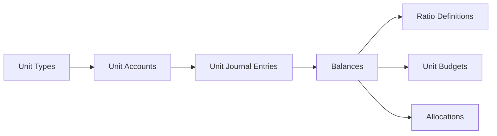

# Unit Accounts Module - User Guide

## What is the Unit Accounts Module?

The **Unit Accounts Module** tracks **non-financial quantities** alongside your financial data. While your General Ledger tracks money (dollars, euros, cedis), Unit Accounts track things you can count but aren't currency:

| Examples | What They Measure |
|----------|-------------------|
| **Employees** | Headcount per department (FTEs) |
| **Square Feet** | Office/warehouse space by location |
| **Hours** | Labor hours, machine hours |
| **Units Produced** | Manufacturing output |
| **Energy** | Kilowatt-hours consumed |

---

## Why Use Unit Accounts?

Unit Accounts enable powerful **KPI analysis** by combining financial and quantity data:

| KPI | Formula | Business Question |
|-----|---------|-------------------|
| Revenue per Employee | Revenue ÷ Headcount | How productive is our workforce? |
| Cost per Square Foot | Rent ÷ Sq Ft | Are we using space efficiently? |
| Revenue per Unit | Sales ÷ Units Sold | What's our average selling price? |

---

## Module Overview

Navigate to **Finance** in the sidebar to access these screens:



---

## Screen-by-Screen Guide

### 1. Unit Types `/finance/unit-types`

**Purpose:** Define what kinds of quantities you want to track.

| Field | Description |
|-------|-------------|
| **Code** | Short identifier (e.g., "EMP", "SQFT") |
| **Name** | Display name (e.g., "Employees") |
| **Decimal Places** | Precision (0 for whole numbers like headcount, 2 for hours) |

**When to use:** Set up once when configuring your system. Common types like Employees, Square Feet, and Hours come pre-configured.


---

### 2. Unit Accounts `/finance/unit-accounts`

**Purpose:** Create a "chart of accounts" for your quantities, organized hierarchically.

**Example Structure:**
```
U-1000 Total Employees
├── U-1100 Sales Department
├── U-1200 Engineering Department
└── U-1300 Admin Department

U-2000 Total Office Space
├── U-2100 Headquarters
└── U-2200 Warehouse
```

| Field | Description |
|-------|-------------|
| **Account Number** | Unique identifier |
| **Unit Type** | What this account measures (Employees, Sq Ft, etc.) |
| **Parent Account** | For hierarchy/rollups |
| **Posting Account** | Can receive journal entries (vs. summary-only) |

**Tip:** Summary accounts (like "Total Employees") automatically roll up their children's balances.


---

### 3. Unit Journal Entries `/finance/unit-journal-entries`

**Purpose:** Record changes to unit quantities (like journal entries for your GL, but for quantities).

**Workflow:**
1. **Draft** → Entry is being prepared
2. **Pending Approval** → Submitted for review
3. **Approved** → Ready to post
4. **Posted** → Balances updated

**Example Entry:**
| Account | Quantity | Description |
|---------|----------|-------------|
| U-1100 Sales Employees | +3 | New hires in March |
| U-1200 Engineering | +5 | Contractor conversions |

**Approval Queue:** Managers can review and approve/reject pending entries at `/finance/unit-journal-entries/approvals`.


---

### 4. Ratio Definitions `/finance/ratio-definitions`

**Purpose:** Define KPIs that combine financial and unit data.

| Component | Options |
|-----------|---------|
| **Numerator** | Financial Account, Unit Account, or Constant |
| **Denominator** | Financial Account, Unit Account, or Constant |
| **Result Format** | Currency, Percentage, or Decimal |

**Example Ratios:**
- **REV-EMP:** Revenue (GL) ÷ Total Employees (Unit) = Revenue per Employee
- **COST-SQFT:** Rent Expense (GL) ÷ Office Space (Unit) = Cost per Sq Ft

**Calculator:** Use the Ratio Calculator at `/finance/ratio-definitions/calculator` to compute any ratio for a selected period.


---

### 5. Unit Budgets `/finance/unit-budgets`

**Purpose:** Plan expected quantities and track variance against actual.

**Variance Analysis:**
| Status | Meaning |
|--------|---------|
| 🟢 **Favorable** | Actual is better than budget |
| 🔴 **Unfavorable** | Actual is worse than budget |
| 🔵 **On Budget** | Actual matches budget exactly |

**Example:**
| Account | Budget | Actual | Variance |
|---------|--------|--------|----------|
| Sales Employees | 25 | 23 | -2 (Favorable if cost savings) |
| Production Hours | 2,400 | 2,650 | +250 (Favorable if productivity) |


---

### 6. Allocations `/finance/allocations`

**Purpose:** Distribute financial amounts across departments using unit quantities as drivers.

**Example Use Case:**
> Allocate $50,000 in IT overhead to departments based on headcount.
> 
> - Sales (23 employees) → receives 28.75% → $14,375
> - Engineering (52 employees) → receives 65% → $32,500
> - Admin (5 employees) → receives 6.25% → $3,125

**Allocation Types:**
| Type | How It Works |
|------|--------------|
| **Unit Account Based** | Proportional to unit balances (e.g., headcount) |
| **Fixed Percentage** | Manual percentages that sum to 100% |
| **Equal Distribution** | Split evenly across all targets |


---

## Putting It All Together: Example Workflow

**Scenario:** Track employee headcount and calculate Revenue per Employee.

### Step 1: Create Unit Type
Go to **Unit Types** → Click **New Unit Type**
- Code: `EMP`
- Name: `Employees`
- Decimal Places: `0`

### Step 2: Create Unit Accounts
Go to **Unit Accounts** → Click **New Unit Account**
- Create "Total Employees" (U-1000) as summary
- Create "Sales Employees" (U-1100) under Total Employees as posting account
- Create "Engineering Employees" (U-1200) under Total Employees

### Step 3: Record Employee Counts
Go to **Unit Journal Entries** → Click **New Entry**
- Add line: U-1100 Sales = 23
- Add line: U-1200 Engineering = 52
- Submit for approval → Get approved → Post

### Step 4: Define Revenue per Employee Ratio
Go to **Ratio Definitions** → Click **New Ratio**
- Code: `REV-EMP`
- Numerator: Financial Account → Revenue
- Denominator: Unit Account → U-1000 Total Employees
- Format: Currency

### Step 5: Calculate and Analyze
Go to **Ratio Calculator** → Select REV-EMP → Select Period → Calculate
- Result: $2,500,000 ÷ 75 employees = **$33,333 per employee**

---

## Quick Reference

| I want to... | Go to... |
|--------------|----------|
| Define what quantities to track | Unit Types |
| Create accounts for quantities | Unit Accounts |
| Record quantity changes | Unit Journal Entries |
| Approve pending entries | Unit Journal Entries → Approvals |
| Create KPI formulas | Ratio Definitions |
| Calculate KPIs for a period | Ratio Calculator |
| Compare budget vs actual | Unit Budgets |
| Distribute costs by quantity | Allocations |
