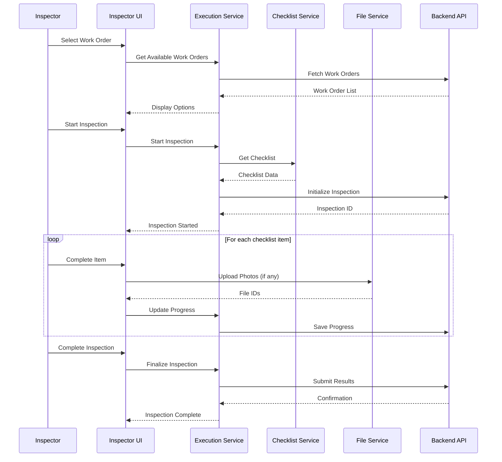
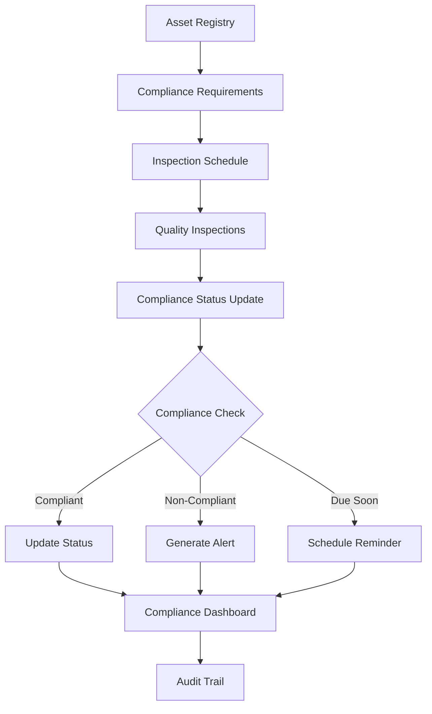

# Quality Control & Checklist Management System

## Overview

The Quality Control & Checklist Management System is a comprehensive solution for managing quality assurance processes, inspector workflows, and regulatory compliance within the ERP maintenance module. This system provides end-to-end functionality from checklist creation to inspection execution, performance analytics, and compliance reporting.

## Table of Contents

- [System Architecture](#system-architecture)
- [Core Features](#core-features)
- [Services](#services)
- [User Interfaces](#user-interfaces)
- [Data Flow](#data-flow)
- [Installation & Setup](#installation--setup)
- [Usage Guide](#usage-guide)
- [API Integration](#api-integration)
- [Development Guide](#development-guide)
- [Troubleshooting](#troubleshooting)

## System Architecture

The quality control system follows a service-oriented architecture with clear separation of concerns:

```
┌─────────────────────────────────────────────────────────────┐
│                     User Interfaces                        │
├─────────────────────────────────────────────────────────────┤
│  Dashboard  │  Analytics  │  Compliance  │  Inspectors     │
│  Checklists │  Inspector  │  Reports     │  Management     │
│  Management │  Interface  │              │                 │
├─────────────────────────────────────────────────────────────┤
│                    Service Layer                           │
├─────────────────────────────────────────────────────────────┤
│ Quality     │ Inspection   │ Regulatory   │ Performance    │
│ Checklist   │ Execution    │ Compliance   │ Analytics      │
│ Service     │ Service      │ Service      │ Service        │
├─────────────────────────────────────────────────────────────┤
│                  Utility Services                          │
├─────────────────────────────────────────────────────────────┤
│          File Upload Service                               │
├─────────────────────────────────────────────────────────────┤
│                   Data Layer                               │
├─────────────────────────────────────────────────────────────┤
│   Backend API    │          Mock Data Fallback            │
└─────────────────────────────────────────────────────────────┘
```

## Core Features

### 1. Quality Checklist Management
- **Checklist Creation**: Create customizable quality checklists with various item types
- **Template System**: Use predefined templates or create custom checklists
- **Versioning**: Track checklist versions and maintain history
- **Item Types**: Support for pass/fail, scored, and measurement-based items
- **Categorization**: Organize checklists by type, asset category, or compliance requirements

### 2. Digital Inspector Interface
- **Mobile-First Design**: Optimized for field inspections on mobile devices
- **Real-Time Execution**: Execute inspections with real-time scoring and validation
- **Photo Evidence**: Capture and attach photos to checklist items
- **Digital Signatures**: Electronic signature capture for inspector validation
- **Offline Capability**: Continue inspections even without internet connectivity
- **Auto-Save**: Automatic progress saving to prevent data loss

### 3. Performance Analytics
- **Inspector Performance**: Track individual inspector metrics and trends
- **Quality Trends**: Monitor quality scores and compliance rates over time
- **Asset Performance**: Analyze asset-specific quality patterns
- **Drill-Down Reports**: Detailed inspection data with filtering capabilities
- **Comparative Analysis**: Compare performance across inspectors, assets, and time periods

### 4. Regulatory Compliance
- **Compliance Tracking**: Monitor regulatory requirement adherence
- **Automated Alerts**: Notifications for upcoming deadlines and violations
- **Audit Trail**: Complete audit log of all compliance-related activities
- **Report Generation**: Generate comprehensive compliance reports
- **Risk Assessment**: Automated risk level calculations based on compliance status

### 5. Inspector Management
- **Profile Management**: Complete inspector profiles with certifications and training
- **Certification Tracking**: Monitor certification status and expiration dates
- **Training Records**: Track training completion and continuing education
- **Performance Metrics**: Individual performance tracking and improvement plans
- **Assignment Management**: Assign inspectors based on qualifications and workload

## Services

### QualityChecklistService

Manages quality checklists with full CRUD operations.

```typescript
interface QualityChecklistService {
  getAllChecklists(): Promise<QualityChecklist[]>;
  getChecklistById(id: string): Promise<QualityChecklist>;
  createChecklist(checklist: CreateChecklistRequest): Promise<QualityChecklist>;
  updateChecklist(id: string, updates: UpdateChecklistRequest): Promise<QualityChecklist>;
  deleteChecklist(id: string): Promise<void>;
  duplicateChecklist(id: string): Promise<QualityChecklist>;
  toggleActiveStatus(id: string): Promise<QualityChecklist>;
}
```

**Key Features:**
- Template-based checklist creation
- Flexible item configuration (pass/fail, scored, measurements)
- Metadata management (compliance requirements, asset types)
- Version control and history tracking
- Mock data fallback for development

### InspectionExecutionService

Handles the execution of quality inspections.

```typescript
interface InspectionExecutionService {
  getWorkOrdersForInspection(): Promise<WorkOrderInfo[]>;
  startInspection(workOrderId: string, checklistId: string): Promise<InspectionExecution>;
  updateInspectionProgress(inspectionId: string, updates: InspectionUpdate): Promise<InspectionExecution>;
  completeInspection(inspectionId: string, completion: InspectionCompletion): Promise<InspectionExecution>;
  getActiveInspections(): Promise<InspectionExecution[]>;
  getInspectionHistory(workOrderId?: string): Promise<InspectionExecution[]>;
}
```

**Key Features:**
- Real-time inspection execution
- Progress tracking and auto-save
- Photo and file attachment support
- Digital signature capture
- Scoring and validation logic
- Work order integration

### RegulatoryComplianceService

Manages regulatory compliance and reporting.

```typescript
interface RegulatoryComplianceService {
  getComplianceDashboard(): Promise<ComplianceDashboard>;
  getAllComplianceStatuses(): Promise<ComplianceStatus[]>;
  getUpcomingDeadlines(days: number): Promise<ComplianceStatus[]>;
  updateComplianceStatus(statusId: string, updates: StatusUpdate): Promise<ComplianceStatus>;
  generateReport(config: ReportConfiguration): Promise<ComplianceReport>;
  getAuditLogs(): Promise<AuditLog[]>;
}
```

**Key Features:**
- Compliance status tracking
- Automated deadline monitoring
- Risk level calculation
- Report generation with customizable formats
- Complete audit trail
- Regulatory requirement management

### PerformanceAnalyticsService

Provides comprehensive performance analytics and reporting.

```typescript
interface PerformanceAnalyticsService {
  getPerformanceDashboard(dateRange?: string): Promise<PerformanceDashboardData>;
  getInspectorPerformance(inspectorId?: string): Promise<InspectorPerformance[]>;
  getAssetQualityMetrics(assetId?: string): Promise<AssetQualityMetrics[]>;
  getComplianceTrends(requirementId?: string): Promise<ComplianceTrend[]>;
  getDrillDownData(filters: DrillDownFilters): Promise<DrillDownData>;
}
```

**Key Features:**
- Multi-dimensional analytics (inspector, asset, compliance)
- Trend analysis and pattern recognition
- Drill-down capabilities for detailed analysis
- Performance benchmarking
- Predictive insights and alerts

### FileUploadService

Handles file uploads with progress tracking and validation.

```typescript
interface FileUploadService {
  uploadFiles(files: File[], metadata?: UploadMetadata): Promise<UploadResult[]>;
  deleteFile(fileId: string): Promise<void>;
  downloadFile(fileId: string): Promise<Blob>;
  getUploadProgress(uploadId: string): Promise<UploadProgress>;
}
```

**Key Features:**
- Multi-file upload support
- Progress tracking with real-time updates
- File type validation and size limits
- Thumbnail generation for images
- Mock upload capability for development
- Error handling and retry logic

## User Interfaces

### 1. Quality Control Dashboard (`/maintenance/quality-control`)

The main dashboard provides an overview of all quality control activities.

**Features:**
- Real-time metrics and KPIs
- Quick action buttons for common tasks
- Active inspections monitoring
- Compliance alerts and notifications
- Performance summary charts

**Components:**
- Overview cards with key metrics
- Quality trends visualization
- Inspection status distribution
- Recent activity feed
- Navigation to sub-modules

### 2. Checklist Management (`/administration/maintenance/quality-checklists`)

Administrative interface for creating and managing quality checklists.

**Features:**
- Checklist creation wizard with templates
- Advanced item configuration
- Metadata and compliance settings
- Version control and history
- Preview and testing capabilities

**Workflow:**
1. Select checklist template or start from scratch
2. Configure checklist metadata (name, description, compliance requirements)
3. Add and configure checklist items
4. Set scoring and validation rules
5. Review and activate checklist

### 3. Digital Inspector Interface (`/maintenance/quality-control/inspect/[workOrderId]`)

Mobile-optimized interface for field inspections.

**Features:**
- Step-by-step inspection workflow
- Photo capture and attachment
- Digital signature collection
- Real-time scoring and validation
- Offline capability with sync
- Progress saving and restoration

**Inspection Flow:**
1. Select work order and start inspection
2. Review checklist and requirements
3. Execute inspection items sequentially
4. Capture evidence (photos, notes, measurements)
5. Review overall results and score
6. Complete with digital signature
7. Submit inspection results

### 4. Performance Analytics (`/maintenance/quality-control/analytics`)

Comprehensive analytics dashboard with multiple views.

**Features:**
- Multi-tab interface (Trends, Inspectors, Assets, Compliance)
- Interactive charts and visualizations
- Date range filtering and comparison
- Drill-down capabilities
- Export functionality
- Performance alerts and recommendations

**Analytics Views:**
- **Quality Trends**: Time-series analysis of quality metrics
- **Inspector Performance**: Individual and comparative performance
- **Asset Performance**: Asset-specific quality patterns and issues
- **Compliance Analytics**: Regulatory compliance trends and status

### 5. Regulatory Compliance (`/maintenance/quality-control/compliance`)

Specialized interface for compliance management and reporting.

**Features:**
- Compliance status overview
- Requirement management
- Report generation with custom parameters
- Audit trail visualization
- Deadline tracking and alerts
- Risk assessment dashboard

### 6. Inspector Management (`/administration/maintenance/inspectors`)

Administrative interface for managing inspector profiles and qualifications.

**Features:**
- Inspector directory with search and filtering
- Profile management with tabs (Profile, Certifications, Training, Performance)
- Certification tracking with expiration alerts
- Training record management
- Performance metrics and analytics
- Qualification-based assignment

## Data Flow

### Inspection Execution Flow



### Compliance Monitoring Flow



## Installation & Setup

### Prerequisites

- Node.js (v18 or higher)
- React 18+
- TypeScript
- Modern web browser with ES2020 support

### Installation Steps

1. **Install Dependencies**
   ```bash
   npm install
   # or
   yarn install
   ```

2. **Configuration**
   
   The system uses environment variables for configuration:
   ```env
   # API Configuration
   NEXT_PUBLIC_API_BASE_URL=http://localhost:5000/api
   
   # File Upload Configuration
   NEXT_PUBLIC_MAX_FILE_SIZE=10485760  # 10MB
   NEXT_PUBLIC_ALLOWED_FILE_TYPES=image/*,application/pdf
   
   # Feature Flags
   NEXT_PUBLIC_ENABLE_OFFLINE_MODE=true
   NEXT_PUBLIC_ENABLE_MOCK_DATA=true
   ```

3. **File Structure Setup**
   
   Ensure the following directory structure exists:
   ```
   frontend/src/
   ├── app/
   │   ├── administration/maintenance/
   │   │   ├── quality-checklists/
   │   │   └── inspectors/
   │   └── maintenance/quality-control/
   │       ├── analytics/
   │       ├── compliance/
   │       └── inspect/[workOrderId]/
   ├── services/
   ├── components/ui/
   └── docs/
   ```

4. **Start Development Server**
   ```bash
   npm run dev
   # or
   yarn dev
   ```

## Usage Guide

### For Administrators

#### Creating Quality Checklists

1. Navigate to **Administration > Maintenance > Quality Checklists**
2. Click **"Create Checklist"**
3. Choose a template or start from scratch
4. Fill in checklist metadata:
   - Name and description
   - Asset types and categories
   - Compliance requirements
5. Add checklist items:
   - Configure item types (pass/fail, scored, measurement)
   - Set scoring weights and validation rules
   - Add descriptions and guidance
6. Review and activate the checklist

#### Managing Inspectors

1. Navigate to **Administration > Maintenance > Inspectors**
2. Add new inspectors with complete profiles
3. Track certifications and training records
4. Monitor performance metrics
5. Assign inspectors to specific work orders

### For Quality Inspectors

#### Executing Inspections

1. Navigate to **Maintenance > Quality Control**
2. Click **"Start Inspection"** and select a work order
3. Review the assigned checklist and requirements
4. Execute inspection items:
   - Mark items as pass/fail or enter scores
   - Capture photos for evidence
   - Add detailed notes where required
5. Review overall results and calculated score
6. Add final comments and digital signature
7. Submit the completed inspection

#### Tracking Performance

1. Access the **Analytics** tab for personal performance metrics
2. Review quality trends and improvement areas
3. Track certification and training requirements
4. Monitor assignment schedules and workload

### For Compliance Officers

#### Monitoring Compliance

1. Navigate to **Quality Control > Compliance**
2. Review compliance dashboard and metrics
3. Track upcoming deadlines and overdue items
4. Generate compliance reports:
   - Select date ranges and requirements
   - Choose export format (PDF, Excel, CSV)
   - Include supporting documentation
5. Monitor audit trail for all compliance activities

## API Integration

### Backend Integration

The system is designed to integrate with RESTful APIs. Each service includes API endpoints for production use:

```typescript
// Example API endpoints
GET    /api/quality-control/checklists
POST   /api/quality-control/checklists
PUT    /api/quality-control/checklists/:id
DELETE /api/quality-control/checklists/:id

GET    /api/quality-control/inspections
POST   /api/quality-control/inspections
PUT    /api/quality-control/inspections/:id

GET    /api/quality-control/compliance/dashboard
GET    /api/quality-control/compliance/status
POST   /api/quality-control/compliance/reports

GET    /api/quality-control/analytics/dashboard
GET    /api/quality-control/analytics/inspector-performance
GET    /api/quality-control/analytics/asset-metrics
```

### Mock Data Fallback

When backend APIs are unavailable, the system automatically falls back to comprehensive mock data, enabling:

- Complete frontend development and testing
- Demo and presentation capabilities
- User training and familiarization
- Continuous operation during backend maintenance

### Authentication Integration

The system integrates with your existing authentication system:

```typescript
// Example authentication integration
const apiRequest = async (url: string, options: RequestInit) => {
  const token = await getAuthToken();
  const headers = {
    ...options.headers,
    'Authorization': `Bearer ${token}`,
    'Content-Type': 'application/json'
  };
  
  return fetch(url, { ...options, headers });
};
```

## Development Guide

### Code Organization

```
src/
├── app/                     # Next.js app directory
│   ├── administration/      # Admin interfaces
│   └── maintenance/         # User interfaces
├── services/               # Business logic services
│   ├── qualityChecklistService.ts
│   ├── inspectionExecutionService.ts
│   ├── regulatoryComplianceService.ts
│   ├── performanceAnalyticsService.ts
│   └── fileUploadService.ts
├── components/ui/          # Reusable UI components
├── types/                  # TypeScript type definitions
└── docs/                   # Documentation
```

### Adding New Features

1. **Service Layer**: Implement business logic in service classes
2. **Type Definitions**: Define TypeScript interfaces for data structures
3. **UI Components**: Create reusable React components
4. **Page Components**: Implement complete page interfaces
5. **Testing**: Add unit tests for services and components
6. **Documentation**: Update this documentation

### Best Practices

- **Service-First Development**: Implement services before UI components
- **Type Safety**: Use TypeScript throughout for type safety
- **Mock Data**: Provide comprehensive mock data for all services
- **Responsive Design**: Ensure mobile-first responsive design
- **Error Handling**: Implement robust error handling and user feedback
- **Performance**: Optimize for performance with lazy loading and caching
- **Accessibility**: Follow WCAG guidelines for accessibility

### Testing Strategy

```typescript
// Service testing example
describe('QualityChecklistService', () => {
  it('should create checklist with valid data', async () => {
    const service = new QualityChecklistService();
    const checklist = await service.createChecklist(mockChecklistData);
    expect(checklist).toBeDefined();
    expect(checklist.id).toBeTruthy();
  });
});

// Component testing example
describe('ChecklistManagement', () => {
  it('should render checklist table', () => {
    render(<ChecklistManagement />);
    expect(screen.getByRole('table')).toBeInTheDocument();
  });
});
```

## Troubleshooting

### Common Issues

#### 1. Service API Errors

**Symptoms**: Services returning error responses or failing to load data
**Solutions**:
- Check network connectivity and API endpoint availability
- Verify authentication tokens and permissions
- Review browser console for detailed error messages
- Ensure mock data fallback is enabled during development

#### 2. File Upload Issues

**Symptoms**: Files failing to upload or showing progress errors
**Solutions**:
- Check file size limits and allowed file types
- Verify network stability for large uploads
- Enable mock upload mode for testing
- Check browser compatibility for File API support

#### 3. Mobile Inspection Issues

**Symptoms**: Inspector interface not working properly on mobile devices
**Solutions**:
- Ensure responsive design CSS is loaded correctly
- Check touch event handlers for mobile interactions
- Verify camera API permissions for photo capture
- Test offline mode functionality

#### 4. Performance Issues

**Symptoms**: Slow loading or unresponsive interface
**Solutions**:
- Check for large data sets being loaded unnecessarily
- Implement pagination for large tables
- Use lazy loading for heavy components
- Optimize image sizes and compression

### Debug Mode

Enable debug mode for additional logging and diagnostics:

```typescript
// Add to environment variables
NEXT_PUBLIC_DEBUG_MODE=true

// Or set in code
if (process.env.NODE_ENV === 'development') {
  console.log('Quality Control System - Debug Mode Enabled');
  // Additional debug logging
}
```

### Support and Maintenance

#### Monitoring

The system includes built-in monitoring capabilities:
- Service health checks
- Performance metrics
- Error tracking and reporting
- User activity analytics

#### Maintenance Tasks

Regular maintenance should include:
- Updating mock data to match production patterns
- Reviewing and updating compliance requirements
- Monitoring inspector certification expiration dates
- Analyzing system performance and usage patterns
- Updating documentation and user guides

#### Backup and Recovery

Important data to backup:
- Quality checklists and templates
- Inspection history and results
- Inspector profiles and certifications
- Compliance requirements and status
- Performance analytics data

---

## Conclusion

The Quality Control & Checklist Management System provides a comprehensive solution for managing quality assurance processes in maintenance operations. With its service-oriented architecture, mobile-optimized interfaces, and robust analytics capabilities, it enables organizations to maintain high quality standards while ensuring regulatory compliance and operational efficiency.

For additional support or questions, please refer to the development team or create an issue in the project repository.

## Version Information

- **System Version**: 2.0.0
- **Last Updated**: January 2024
- **Documentation Version**: 1.0.0
- **Compatible with**: ERP System v3.x+

## License

This documentation and the Quality Control System are part of the ERP System project. All rights reserved.