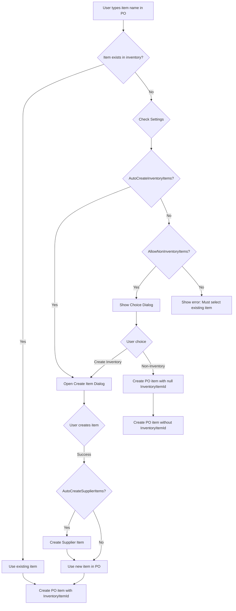
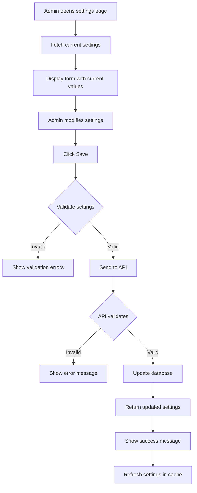

# Purchase Order Settings Implementation Plan

## Overview
Implement a Purchase Order Settings feature that allows administrators to configure how the system handles items when creating purchase orders, particularly when users type item names instead of selecting from existing inventory items.

## Business Requirements

### Setting Options

1. **Auto-Create Inventory Items** (`AutoCreateInventoryItems`)
   - When enabled: System prompts user to create a new inventory item when they type an item name that doesn't exist
   - When disabled: Item is treated as non-inventory item (exists only in PO)

2. **Auto-Create Supplier Items** (`AutoCreateSupplierItems`)
   - When enabled (and AutoCreateInventoryItems is also enabled): Automatically creates a supplier item catalog entry linking the new inventory item to the business partner
   - When disabled: Only creates the inventory item without supplier catalog entry

3. **Allow Non-Inventory Items** (`AllowNonInventoryItems`)
   - When enabled: Users can create PO items without linking to inventory (InventoryItemId = null)
   - When disabled: Users must either select existing inventory items or create new ones

### Workflow Scenarios

#### Scenario 1: Auto-Create Enabled
- User types item name in PO creation
- System checks if item exists in inventory
- If not found: Opens "Create Inventory Item" dialog pre-filled with typed name
- User completes item details and saves
- If AutoCreateSupplierItems is enabled: Also creates supplier catalog entry
- PO item is created with the new InventoryItemId

#### Scenario 2: Prompt User (Auto-Create Disabled, Allow Non-Inventory Enabled)
- User types item name in PO creation
- System checks if item exists in inventory
- If not found: Shows dialog asking "Create as inventory item or non-inventory item?"
- User chooses:
  - **Create Inventory Item**: Opens create dialog
  - **Non-Inventory Item**: Creates PO item with InventoryItemId = null

#### Scenario 3: Force Inventory Items (Both Disabled)
- User must select from existing inventory items dropdown
- Typing is disabled or only filters existing items
- Cannot create PO without valid InventoryItemId

## Technical Architecture

### Backend Components

#### 1. Entity: ProcurementSettings
```csharp
Location: src/ErpSystem.Core/Entities/Procurement/ProcurementSettings.cs

public class ProcurementSettings : TenantEntity
{
    // Item Creation Settings
    public bool AutoCreateInventoryItems { get; set; } = false;
    public bool AutoCreateSupplierItems { get; set; } = false;
    public bool AllowNonInventoryItems { get; set; } = true;
    
    // Default Values for New Items
    public Guid? DefaultItemCategoryId { get; set; }
    public Guid? DefaultUnitOfMeasureId { get; set; }
    public string? DefaultValuationMethod { get; set; } = "FIFO";
    
    // Purchase Order Settings
    public bool RequireApprovalForPO { get; set; } = true;
    public decimal? AutoApprovalThreshold { get; set; }
    public bool AllowBackorders { get; set; } = true;
    public bool RequireDeliveryDate { get; set; } = true;
    
    // Supplier Settings
    public bool EnforceSupplierCatalog { get; set; } = false;
    public bool AllowMultipleSuppliersPerItem { get; set; } = true;
    
    // Validation Settings
    public bool ValidateBudgetBeforePO { get; set; } = false;
    public bool RequireContractForPO { get; set; } = false;
    
    // Notes
    public string? Notes { get; set; }
}
```

#### 2. DTOs
```csharp
Location: src/ErpSystem.Core/DTOs/Procurement/ProcurementSettingsDTOs.cs

public class ProcurementSettingsDto
{
    public Guid Id { get; set; }
    public bool AutoCreateInventoryItems { get; set; }
    public bool AutoCreateSupplierItems { get; set; }
    public bool AllowNonInventoryItems { get; set; }
    public Guid? DefaultItemCategoryId { get; set; }
    public Guid? DefaultUnitOfMeasureId { get; set; }
    public string? DefaultValuationMethod { get; set; }
    public bool RequireApprovalForPO { get; set; }
    public decimal? AutoApprovalThreshold { get; set; }
    public bool AllowBackorders { get; set; }
    public bool RequireDeliveryDate { get; set; }
    public bool EnforceSupplierCatalog { get; set; }
    public bool AllowMultipleSuppliersPerItem { get; set; }
    public bool ValidateBudgetBeforePO { get; set; }
    public bool RequireContractForPO { get; set; }
    public string? Notes { get; set; }
    public DateTime CreatedAt { get; set; }
    public DateTime? UpdatedAt { get; set; }
}

public class UpdateProcurementSettingsDto
{
    public bool AutoCreateInventoryItems { get; set; }
    public bool AutoCreateSupplierItems { get; set; }
    public bool AllowNonInventoryItems { get; set; }
    public Guid? DefaultItemCategoryId { get; set; }
    public Guid? DefaultUnitOfMeasureId { get; set; }
    public string? DefaultValuationMethod { get; set; }
    public bool RequireApprovalForPO { get; set; }
    public decimal? AutoApprovalThreshold { get; set; }
    public bool AllowBackorders { get; set; }
    public bool RequireDeliveryDate { get; set; }
    public bool EnforceSupplierCatalog { get; set; }
    public bool AllowMultipleSuppliersPerItem { get; set; }
    public bool ValidateBudgetBeforePO { get; set; }
    public bool RequireContractForPO { get; set; }
    public string? Notes { get; set; }
}
```

#### 3. Repository Interface
```csharp
Location: src/ErpSystem.Core/Interfaces/Procurement/IProcurementSettingsRepository.cs

public interface IProcurementSettingsRepository : IGenericRepository<ProcurementSettings>
{
    Task<ProcurementSettings?> GetByTenantIdAsync(Guid tenantId);
    Task<ProcurementSettings> GetOrCreateDefaultAsync(Guid tenantId);
}
```

#### 4. Repository Implementation
```csharp
Location: src/ErpSystem.Data/Repositories/Procurement/ProcurementSettingsRepository.cs

public class ProcurementSettingsRepository : GenericRepository<ProcurementSettings>, IProcurementSettingsRepository
{
    public async Task<ProcurementSettings?> GetByTenantIdAsync(Guid tenantId);
    public async Task<ProcurementSettings> GetOrCreateDefaultAsync(Guid tenantId);
}
```

#### 5. Service Interface
```csharp
Location: src/ErpSystem.Core/Interfaces/Procurement/IProcurementSettingsService.cs

public interface IProcurementSettingsService
{
    Task<ProcurementSettingsDto> GetSettingsAsync();
    Task<ProcurementSettingsDto> UpdateSettingsAsync(UpdateProcurementSettingsDto dto);
    Task<bool> ShouldAutoCreateInventoryItemsAsync();
    Task<bool> ShouldAutoCreateSupplierItemsAsync();
    Task<bool> AllowNonInventoryItemsAsync();
}
```

#### 6. Service Implementation
```csharp
Location: src/ErpSystem.Core/Services/Procurement/ProcurementSettingsService.cs

public class ProcurementSettingsService : IProcurementSettingsService
{
    // Implements all interface methods
    // Uses repository to fetch/update settings
    // Caches settings for performance
}
```

#### 7. API Controller
```csharp
Location: src/ErpSystem.Api/Controllers/Procurement/ProcurementSettingsController.cs

[ApiController]
[Route("api/procurement/[controller]")]
[Authorize(Roles = "SuperAdmin,TenantAdmin")]
public class ProcurementSettingsController : ControllerBase
{
    [HttpGet]
    public async Task<ActionResult<ProcurementSettingsDto>> GetSettings();
    
    [HttpPut]
    public async Task<ActionResult<ProcurementSettingsDto>> UpdateSettings([FromBody] UpdateProcurementSettingsDto dto);
}
```

### Frontend Components

#### 1. Settings Page
```typescript
Location: frontend/src/app/administration/procurement/purchase-order-settings/page.tsx

Features:
- Form with toggle switches for each setting
- Grouped sections (Item Creation, PO Settings, Supplier Settings, Validation)
- Save button with loading state
- Success/error notifications
- Help text for each setting
```

#### 2. Frontend Service
```typescript
Location: frontend/src/services/procurementSettingsService.ts

export const procurementSettingsService = {
  getSettings: () => Promise<ProcurementSettingsDto>,
  updateSettings: (dto: UpdateProcurementSettingsDto) => Promise<ProcurementSettingsDto>,
};
```

#### 3. Create Inventory Item Dialog
```typescript
Location: frontend/src/components/procurement/CreateInventoryItemDialog.tsx

Features:
- Pre-filled with item name from PO
- All required inventory item fields
- Option to also create supplier item (if setting enabled)
- Validation
- Returns created item ID to PO form
```

#### 4. Item Type Selection Dialog
```typescript
Location: frontend/src/components/procurement/ItemTypeSelectionDialog.tsx

Features:
- Simple dialog asking: "Create as inventory item or non-inventory item?"
- Two buttons: "Create Inventory Item" and "Non-Inventory Item"
- Opens CreateInventoryItemDialog if user chooses inventory item
- Returns choice to PO form
```

#### 5. Updated PO Creation Form
```typescript
Location: frontend/src/app/procurement/purchase-orders/create/page.tsx (or component)

Updates:
- Check settings when user types item name
- Show appropriate dialog based on settings
- Handle three scenarios:
  1. Auto-create: Automatically open create dialog
  2. Prompt: Show choice dialog
  3. Force inventory: Disable typing, only allow selection
```

## Database Schema

### ProcurementSettings Table
```sql
CREATE TABLE ProcurementSettings (
    Id UNIQUEIDENTIFIER PRIMARY KEY,
    TenantId UNIQUEIDENTIFIER NOT NULL,
    
    -- Item Creation Settings
    AutoCreateInventoryItems BIT NOT NULL DEFAULT 0,
    AutoCreateSupplierItems BIT NOT NULL DEFAULT 0,
    AllowNonInventoryItems BIT NOT NULL DEFAULT 1,
    
    -- Default Values
    DefaultItemCategoryId UNIQUEIDENTIFIER NULL,
    DefaultUnitOfMeasureId UNIQUEIDENTIFIER NULL,
    DefaultValuationMethod NVARCHAR(20) NULL DEFAULT 'FIFO',
    
    -- PO Settings
    RequireApprovalForPO BIT NOT NULL DEFAULT 1,
    AutoApprovalThreshold DECIMAL(18,2) NULL,
    AllowBackorders BIT NOT NULL DEFAULT 1,
    RequireDeliveryDate BIT NOT NULL DEFAULT 1,
    
    -- Supplier Settings
    EnforceSupplierCatalog BIT NOT NULL DEFAULT 0,
    AllowMultipleSuppliersPerItem BIT NOT NULL DEFAULT 1,
    
    -- Validation Settings
    ValidateBudgetBeforePO BIT NOT NULL DEFAULT 0,
    RequireContractForPO BIT NOT NULL DEFAULT 0,
    
    -- Metadata
    Notes NVARCHAR(MAX) NULL,
    CreatedAt DATETIME2 NOT NULL DEFAULT GETUTCDATE(),
    CreatedById UNIQUEIDENTIFIER NULL,
    UpdatedAt DATETIME2 NULL,
    UpdatedById UNIQUEIDENTIFIER NULL,
    
    CONSTRAINT FK_ProcurementSettings_Tenant FOREIGN KEY (TenantId) REFERENCES Tenants(Id),
    CONSTRAINT UQ_ProcurementSettings_Tenant UNIQUE (TenantId)
);
```

## UI/UX Design

### Settings Page Layout

```
┌─────────────────────────────────────────────────────────────┐
│ Purchase Order Settings                                      │
├─────────────────────────────────────────────────────────────┤
│                                                               │
│ Item Creation Settings                                       │
│ ┌───────────────────────────────────────────────────────┐   │
│ │ ☐ Auto-create inventory items                         │   │
│ │   When enabled, prompt users to create inventory      │   │
│ │   items for new item names                            │   │
│ │                                                         │   │
│ │ ☐ Auto-create supplier items                          │   │
│ │   Also create supplier catalog entries (requires      │   │
│ │   auto-create inventory items)                        │   │
│ │                                                         │   │
│ │ ☑ Allow non-inventory items                           │   │
│ │   Allow PO items without inventory tracking           │   │
│ └───────────────────────────────────────────────────────┘   │
│                                                               │
│ Default Values                                               │
│ ┌───────────────────────────────────────────────────────┐   │
│ │ Default Item Category:    [Select Category ▼]         │   │
│ │ Default Unit of Measure:  [Select UoM ▼]              │   │
│ │ Default Valuation Method: [FIFO ▼]                    │   │
│ └───────────────────────────────────────────────────────┘   │
│                                                               │
│ Purchase Order Settings                                      │
│ ┌───────────────────────────────────────────────────────┐   │
│ │ ☑ Require approval for PO                             │   │
│ │ Auto-approval threshold: [10000.00]                   │   │
│ │ ☑ Allow backorders                                    │   │
│ │ ☑ Require delivery date                               │   │
│ └───────────────────────────────────────────────────────┘   │
│                                                               │
│ Supplier Settings                                            │
│ ┌───────────────────────────────────────────────────────┐   │
│ │ ☐ Enforce supplier catalog                            │   │
│ │   Only allow items from supplier's catalog            │   │
│ │ ☑ Allow multiple suppliers per item                   │   │
│ └───────────────────────────────────────────────────────┘   │
│                                                               │
│ Validation Settings                                          │
│ ┌───────────────────────────────────────────────────────┐   │
│ │ ☐ Validate budget before PO                           │   │
│ │ ☐ Require contract for PO                             │   │
│ └───────────────────────────────────────────────────────┘   │
│                                                               │
│ Notes                                                         │
│ ┌───────────────────────────────────────────────────────┐   │
│ │ [Text area for additional notes]                      │   │
│ └───────────────────────────────────────────────────────┘   │
│                                                               │
│                                    [Cancel] [Save Settings]  │
└─────────────────────────────────────────────────────────────┘
```

### Create Inventory Item Dialog

```
┌─────────────────────────────────────────────────────────────┐
│ Create Inventory Item                                    [X] │
├─────────────────────────────────────────────────────────────┤
│                                                               │
│ Item Code:        [AUTO-GENERATED]                           │
│ Item Name:        [Pre-filled from PO]                       │
│ Description:      [                                    ]      │
│ Category:         [Select Category ▼]                        │
│ Unit of Measure:  [Select UoM ▼]                             │
│ Valuation Method: [FIFO ▼]                                   │
│ Item Type:        [Inventory ▼]                              │
│                                                               │
│ ☑ Also create supplier item for this business partner        │
│   Supplier Item Code: [                    ]                 │
│   Supplier Price:     [                    ]                 │
│                                                               │
│                                    [Cancel] [Create Item]    │
└─────────────────────────────────────────────────────────────┘
```

### Item Type Selection Dialog

```
┌─────────────────────────────────────────────────────────────┐
│ Item Not Found                                           [X] │
├─────────────────────────────────────────────────────────────┤
│                                                               │
│ The item "Office Supplies - Pens" was not found in           │
│ inventory.                                                    │
│                                                               │
│ How would you like to proceed?                               │
│                                                               │
│ ┌───────────────────────────────────────────────────────┐   │
│ │ 📦 Create as Inventory Item                           │   │
│ │    Track this item in inventory system                │   │
│ └───────────────────────────────────────────────────────┘   │
│                                                               │
│ ┌───────────────────────────────────────────────────────┐   │
│ │ 📄 Use as Non-Inventory Item                          │   │
│ │    One-time purchase, no inventory tracking           │   │
│ └───────────────────────────────────────────────────────┘   │
│                                                               │
│                                              [Cancel]         │
└─────────────────────────────────────────────────────────────┘
```

## Implementation Flow

### Phase 1: Backend Foundation
1. Create `ProcurementSettings` entity
2. Create database migration
3. Create DTOs
4. Create repository interface and implementation
5. Create service interface and implementation
6. Create API controller
7. Register services in DI container

### Phase 2: Frontend Settings Page
1. Create settings page component
2. Create settings service
3. Add menu item to sidebar
4. Implement form with all settings
5. Add validation and error handling

### Phase 3: PO Creation Integration
1. Create `CreateInventoryItemDialog` component
2. Create `ItemTypeSelectionDialog` component
3. Update PO creation form to:
   - Fetch settings on load
   - Check settings when user types item name
   - Show appropriate dialog based on settings
   - Handle item creation responses
4. Update PO item creation logic to support nullable InventoryItemId

### Phase 4: Testing & Validation
1. Test all three scenarios
2. Test with different setting combinations
3. Verify supplier item creation
4. Verify non-inventory item handling
5. Test permissions and authorization

## Data Flow Diagrams

### PO Item Creation Flow



### Settings Update Flow



## API Endpoints

### GET /api/procurement/ProcurementSettings
- **Description**: Get current procurement settings for tenant
- **Authorization**: SuperAdmin, TenantAdmin
- **Response**: `ProcurementSettingsDto`

### PUT /api/procurement/ProcurementSettings
- **Description**: Update procurement settings
- **Authorization**: SuperAdmin, TenantAdmin
- **Request Body**: `UpdateProcurementSettingsDto`
- **Response**: `ProcurementSettingsDto`

## Validation Rules

1. **AutoCreateSupplierItems** can only be enabled if **AutoCreateInventoryItems** is also enabled
2. If **AllowNonInventoryItems** is disabled, **AutoCreateInventoryItems** should be enabled
3. **AutoApprovalThreshold** must be positive if set
4. **DefaultValuationMethod** must be one of: FIFO, WAC, Standard, LIFO

## Security Considerations

1. Only SuperAdmin and TenantAdmin can modify settings
2. Settings are tenant-specific (multi-tenant isolation)
3. Audit log all settings changes
4. Validate user permissions before creating inventory items

## Performance Considerations

1. Cache settings in memory to avoid repeated database queries
2. Invalidate cache when settings are updated
3. Use singleton pattern for settings service
4. Index TenantId in ProcurementSettings table

## Migration Strategy

1. Create migration with default values
2. Seed default settings for existing tenants
3. Ensure backward compatibility (default: AllowNonInventoryItems = true)
4. No breaking changes to existing PO creation flow

## Testing Checklist

- [ ] Settings CRUD operations work correctly
- [ ] Settings are tenant-isolated
- [ ] Auto-create inventory items works
- [ ] Auto-create supplier items works
- [ ] Non-inventory items can be created when allowed
- [ ] Non-inventory items are blocked when not allowed
- [ ] Choice dialog appears when appropriate
- [ ] Create item dialog pre-fills correctly
- [ ] Supplier item is created when setting enabled
- [ ] Settings cache invalidates on update
- [ ] Permissions are enforced
- [ ] Validation rules work correctly

## Future Enhancements

1. **Email notifications** when settings are changed
2. **Approval workflow** for settings changes
3. **Settings history** tracking
4. **Import/Export** settings between tenants
5. **Role-based settings** (different settings for different user roles)
6. **Item templates** for quick creation
7. **Bulk item creation** from PO
8. **AI-powered item matching** to suggest existing items
