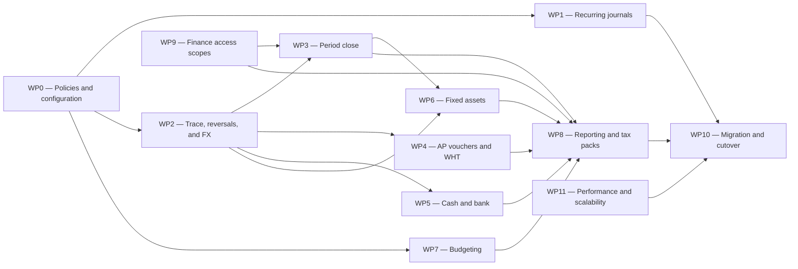

# TDC Finance-Only Gaps — Master Implementation Plan

**Plan date:** 2026-08-02  
**Status:** Active implementation plan; AP/AR/cash reversal, access-scope, period-close, AP voucher/evidence/statement, Finance-owned WHT lifecycle, cashier/till, bank-deposit, controlled payment-slip/receipt, and cross-currency bank-transfer slices implemented  
**Source baseline:** TDC Finance requirements review dated 2026-08-02, current RHEMA ERP implementation, and `docs/finance-go-live-limitations-register.md`  
**Scope rule:** Implement Finance-owned capabilities only. Live integrations with non-Finance modules or external services are explicitly excluded from this plan.

## 1. Outcome

This plan closes the genuinely outstanding Finance-module gaps while preserving the Finance controls and accounting foundations that are already implemented. It also accounts for every documented limitation from `FIN-LIM-0001` through `FIN-LIM-0054`.

The delivery strategy is to strengthen transaction integrity first, then build the close, operational, asset, budget, reporting, security, migration, and performance capabilities on top of that foundation. A limitation marked **Resolved** is not scheduled for reimplementation; it receives regression coverage. A limitation requiring another module remains visible in the disposition matrix but is not included in a Finance implementation work package.

No calendar dates are assigned yet. Dates should be added only after the delivery team, available capacity, and release constraints are confirmed.

### 1.1 Implementation progress as at 2026-08-03

The initial vertical slices from section 13 have been implemented and are ready for migration/UAT review:

- WP0: tenant-configurable reversal-date policy, minimum reversal-reason length, and staged Finance access-scope activation.
- WP2/WP4: posted AP payment source-to-ledger trace and immutable, idempotent compensating reversal through the existing central posting engine.
- WP9 / `FIN-LIM-0014`: effective-dated tenant and bank-account access grants, server-side AP payment filtering/command enforcement, administration UI, denial audit events, and administrator recovery access.
- `FIN-LIM-0009`: the documented posted-AP-payment reversal limitation is resolved in code, subject to database migration and UAT acceptance.
- WP2 / `FIN-LIM-0010`: posted AR customer receipts now have a source-to-ledger trace and immutable, idempotent compensating reversal across GL, realized FX, invoice allocations, customer balance, and the bank/liquidity operational subledger.
- WP9 expansion: AR receipt list, direct read, trace, creation, update, allocation, posting, clearing, bounce, and customer-history access now enforce the same Finance tenant/bank data-scope model. Liquidity-held receipts deliberately require tenant-wide scope until liquidity-account grants are introduced.
- The AR detail UI exposes the reversal permission gate, tenant reason policy, current-open-period date handling, allocation lineage, operational evidence, journal lines, and audit history.
- WP2/WP5 / `FIN-LIM-0011`: posted Finance-owned cash receipts, payments, and paired bank transfers now use an immutable, idempotent compensating reversal through the central posting engine, with per-bank correction rows, balance-snapshot restoration, reconciliation/source-ownership guards, and full trace UI.
- WP9 expansion: cash/bank lists, bank-specific reads, commands, workflow actions, posting, trace, and reversals now enforce tenant/bank Finance scopes; transfers require scope to both accounts.
- WP3 first and second slices: the existing Fiscal Period service now persists numbered close cycles, immutable check snapshots, preparer certification, second-person close approval, reopen/reclose history, approved month/quarter/year template versions, copied task definitions, and manual task evidence completion. The General Ledger compatibility methods delegate to the same owner.
- WP3/WP6 / `FIN-LIM-0034`: due active-asset depreciation, failed runs, and invalid depreciation journal/posting-event evidence are now a TDC-default mandatory close blocker controlled by an audited tenant setting.
- WP3 third slice: active tenants now receive idempotent TDC month/quarter/year baseline data through migration, startup, and tenant provisioning. The close workspace reuses the existing settlement read model for mandatory AP/AR control-account reconciliation and warning-level itemized unapplied-payment/receipt/advance review.
- WP3 fourth through sixth slices: recurring-journal exceptions and approved-budget adoption are persisted providers; close tasks retain controlled binary evidence; eligible exceptions use a different-user, evidence-fingerprinted waiver whose approval expires automatically when the measured exception changes; and idempotent task, waiver-review, and final-close aging alerts now flow through the existing notification service with a retained escalation audit.
- WP3 seventh slice: every approved numbered cycle now renders a tenant-secured, audited QuestPDF close pack containing the electronic maker/checker certificate, final controls, reconciliation and exception summaries, waiver/evidence/alert registers, reopen history, a stable evidence digest, and visible preservation of the `FIN-LIM-0034` non-waivable control set.
- WP3 controlled reopen completion: closed/locked periods now use a separate request/review/approval workspace, changed-period fingerprint, maker-checker enforcement, later-period blockers, retained cycle N+1 lineage, alerts, escalation, audit, and dedicated permissions.
- WP4 first slice: authorized AP payments now render a tenant/bank-scope-secured, audited A4 payment voucher from the canonical `VendorPayment`. The existing payment number remains the voucher number; payee, amount in words, allocation/advance state, WHT, posted account coding, approvals, workflow evidence and reversal state remain one traceable chain.
- WP4 second slice: direct AP payments now submit through the existing workflow engine under an immutable effective-dated policy snapshot. TDC baseline, cash, mobile-money, high-value, and high-value cash policies select named independently verified evidence; exceptional/evidence-exception requests force a conditional Managing Director stage; maker-checker publishing, evidence verification, rejection/resubmission, audit, payment-detail upload/review, and posting authorization gates are enforced.
- WP4 third slice: supplier statements now render through the existing parameterized document-output pipeline as controlled A4 PDFs and native formula-driven XLSX workbooks. The report screen, CSV, PDF, workbook and compatibility JSON endpoint use the same AP detailed-ledger calculation path; output permission, tenant isolation, success/failure audit and emitted-byte hashes are enforced.
- WP4 fourth slice / `FIN-LIM-0004` / `FIN-LIM-0054`: AP invoices now select tenant purchase-WHT configuration instead of fixed percentages; AP payments enforce payment-date annual supplier thresholds and retain calculation snapshots; AR receipts expose configured WHT/VAT-WHT suffered entry; immutable certificate issue/reissue/cancel versions, remittance evidence states, authority references, register export, permissions and audit are operational. Migration `20260803144941_AddWhtComplianceLifecycle` is applied to `RHEMAERP`.
- WP5 first slice: Finance now has cashier-owned physical till sessions with opening-float custody, live immutable liquidity-entry movement, posted-deposit deduction, denomination counts, a frozen close snapshot, reason-required variance, independent review, correction lineage, evidence references, permissions, audit, and an operator/reviewer workspace. Migration `20260803163336_AddCashierTillControlWorkspace` and the `TILL-MAIN-GHS` seed are applied to `RHEMAERP`.
- WP5 second slice: the existing bank-deposit workflow now retains a unique bank acknowledgement reference and date, optional controlled acknowledgement evidence, dedicated confirmation permission, maker-checker enforcement, optimistic concurrency, and Finance audit history. Deposit views derive reconciliation status from the existing bank-facing cash transaction and reconciliation rather than maintaining a competing status record. Migration `20260803182450_AddBankDepositConfirmationControls` is applied to `RHEMAERP`, and the TDC `Chief Accountant` baseline role has the new confirmation permission.
- WP5 third slice / `FR-CB-008`: posted Finance cash/bank payments and canonical AR customer payments now render as controlled A4 payment slips and official receipts. One Original is enforced transactionally; every later copy requires a substantive reason and narrower replacement permission, is watermarked on every page, and retains copy sequence, issuer, time, exact PDF hash, source/journal lineage, and a distinct Finance audit event. Migration `20260803193523_AddControlledCashBankDocumentIssuance` is applied to `RHEMAERP`, and the TDC role grants are seeded.
- WP2/WP5 fourth slice / `FIN-LIM-0021`: cross-currency bank transfers now retain separate source and destination native amounts, approved effective-dated rate evidence per leg, a server preview, an idempotent pair key, functional-currency values, and explicit realised gain/loss. The shared posting engine produces the balanced bank/FX journal; each leg reconciles independently in its own currency; and reversal preserves both original native snapshots. Migration `20260803213749_AddCrossCurrencyBankTransfers` is applied and schema-verified in `RHEMAERP`.
- WP2 / `FIN-LIM-0013`: the legacy `CustomerPayment.IsCreditNote` compatibility path is retired for all new writes and mutations. Historical rows remain readable while new credits and corrections are routed to the canonical Sales credit-note workflow.

WP3 is complete for the Finance-only scope described here. WP0, WP2, WP4, WP5, and WP9 remain partial; AP/AR cross-currency settlement, broader report/export scope propagation, liquidity-account-specific access grants, portal-specific statutory filing interfaces, and the other work-package items stay in the backlog below.

## 2. Scope boundary

### 2.1 Included

- General ledger controls, recurring journals, traceability, corrections, and reversals.
- Finance-side foreign-currency transfers, settlements, and reconciliation.
- Finance period-close orchestration, certification, and close reporting.
- Accounts payable vouchers, evidence, statements, exceptional-payment controls, and withholding-tax workflow.
- Cash and bank operations that can run without live bank, mobile-money, or POS connectivity.
- Finance-owned fixed-asset lifecycle capabilities, including accounting entries to AR, cash/bank, and tax within Finance.
- Budget preparation, approval, revisions, actuals, and monitoring using Finance data.
- Finance reports, statutory packs, notes, exports, schedules, and distribution.
- Finance-specific access scope and control enforcement.
- Finance data migration, reconciliation, and sign-off.
- Finance-specific performance, scalability, auditability, and security hardening.

### 2.2 Excluded interface-dependent requirements

The following remain valid backlog items but are not scheduled in this Finance-only plan:

| Area | Excluded requirements | Reason |
|---|---|---|
| Property, billing, estate, and legal integration | `FR-GL-007`, `FR-AR-001`–`FR-AR-004`, `FR-AR-007`–`FR-AR-012`, Revenue/Billing items, `CBK-001`, `CBK-002`, `CBK-006`, `CBK-008` | Requires live source transactions or status from other business modules. |
| External payment channels | `FR-CB-009`, `CBK-003`, relevant portions of `FR-CB-011` | Requires bank, mobile-money, POS, or payment-gateway connectivity. |
| Procurement integration | `FR-FA-002`, `FR-BG-008`–`FR-BG-010`, `FAR-003`, the shared supplier-master portion of `FR-AP-002` | Requires GRV, requisition, purchase-order, contract, or shared supplier-master flows. |
| Payroll integration | `PAY-002` and payroll/SSNIT portions of reporting requirements | Requires Payroll-owned source data or processing. |
| General integration catalogue | `SRS-INT-001`–`SRS-INT-004`, `NFR-INT` | Cross-module or external-interface work. |
| Platform operations | `NFR-AVL`, `NFR-BCK`, `NFR-MNT`, `NFR-SUP` | Platform-wide rather than Finance-module delivery. |

### 2.3 Finance-only treatment of mixed requirements

- `FR-PC-002`, `FR-PC-003`, and `FR-PC-005` cover only GL, AP, AR, cash/bank, fixed assets, budgets, and Finance reporting in this phase.
- `FR-RP-001` covers Finance and statutory reporting; Payroll-sourced SSNIT output is deferred.
- `FR-RP-005` covers Finance AP, AR, bank, asset, audit, and exception reporting; Procurement reporting is deferred.
- `FR-RP-006` and `FR-RP-007` use Finance-owned dimensions and sources only.
- `FR-CB-011` covers cash and bank data held in Finance; mobile-money data is deferred.
- `FR-FA-008` supports manual Board-of-Survey references and evidence. It does not fetch or initiate Procurement records.
- `EXP-001` and `EXP-002` use Finance voucher data and manually supplied evidence; HR and Procurement auto-fetching is deferred.
- `FIN-LIM-0014` receives a Finance-specific access-scope mitigation. Replacing the platform-wide global role-grant model is not part of this plan.

## 3. Foundations to retain and extend

The implementation must reuse the existing Finance foundations rather than introduce parallel accounting paths:

- `IFinancePostingEngine` / `FinancePostingEngine` remains the sole production posting engine.
- Existing AP, AR, cash/bank, tax, foreign-exchange, fixed-asset, budget, reporting, migration, and fiscal-period services remain the system of record in their domains.
- Posted transactions are corrected through controlled reversals or adjustment transactions; they are never edited in place.
- All new workflows use tenant, company, fiscal-period, branch, currency, and Finance access-scope checks.
- All posted outcomes retain source document, source module, source transaction, journal, approval, reversal, and evidence references.
- Existing resolved `FIN-LIM` capabilities are protected with regression tests before dependent work is released.

## 4. Delivery sequence



`WP0`, `WP2`, and the initial `WP9` authorization model are release foundations. Work packages may overlap after their dependency gates pass, but migration and production cutover remain the final release-readiness stage.

## 5. Work-package summary

| WP | Work package | Principal requirement coverage | Size | Primary exit condition |
|---|---|---|---|---|
| WP0 | Finance policy and workflow configuration | `FR-GL-002`, `FR-BG-001`, `FR-AP-006`, `FR-AP-008`, `EXP-003`, `FR-BG-006`, `SRS-CONTROL-001`, `SRS-CONTROL-002`, `SRS-CONTROL-004` | M | Approved configuration catalogue and maker-checker policy are active. |
| WP1 | Recurring journals | `FR-GL-006` | M | Recurring templates generate reviewable, idempotent Finance journals on schedule. |
| WP2 | Ledger trace, reversals, and foreign currency | `FR-GL-009`, `FR-GL-010`, `FR-AP-009`, `FR-CB-005`, `FR-CB-010` | XL | Supported Finance transactions have end-to-end trace, controlled reversal, and correct FX settlement. |
| WP3 | Finance period close | `FR-PC-001`, `FR-PC-002`, `FR-PC-003`, `FR-PC-005`, `FR-PC-006`, `FR-PC-007`, `FR-PC-008` | XL | A close cycle cannot complete until configured Finance checks and certifications pass. |
| WP4 | AP vouchers, evidence, statements, and WHT | `FR-AP-006`–`FR-AP-011`, `EXP-001`–`EXP-003` | L | Voucher, evidence, approval, statement, exceptional-payment, and certificate paths are operational. |
| WP5 | Cash and bank operations | `FR-CB-005`, `FR-CB-008`, `FR-CB-010`, `FR-CB-011`, `CBK-005` | L | Finance can control tills, deposits, slips, reversals, reconciliation, and bank reports without live channels. |
| WP6 | Fixed-asset lifecycle completion | `FR-FA-004`, `FR-FA-008`, `FR-FA-011` | XL | All in-scope asset lifecycle events have approved workflows, postings, reversals, and reports. |
| WP7 | Budget preparation and control | `FR-BG-001`–`FR-BG-003`, `FR-BG-006`, `FR-BG-011`–`FR-BG-015` | XL | Approved budgets, revisions, actuals, and monitoring reports are controlled and auditable. |
| WP8 | Finance reporting, tax packs, and distribution | `FR-RP-001`–`FR-RP-008`, `FR-RP-010`, `FR-RP-011`, `NFR-CMP`, `NFR-RPT` | XL | Approved Finance packs render consistently in-app, PDF, and spreadsheet formats and can run on schedule. |
| WP9 | Finance access scopes and security | `SRS-CONTROL-005`, `NFR-SEC` | L | Finance data and actions are constrained by explicit tenant/company/branch/account/dimension scope. |
| WP10 | Finance migration and cutover | `SRS-MIG-001`–`SRS-MIG-006`, `FAR-001` | XL | Finance opening data reconciles to signed source/control totals and is approved for cutover. |
| WP11 | Finance performance and scalability | `NFR-PER`, `NFR-SCA` | M | Agreed Finance workloads meet measured service-level targets at target volumes. |

Sizes are relative complexity indicators, not duration commitments.

## 6. Detailed implementation plan

### WP0 — Finance policy and workflow configuration

**Objective:** Convert policy-dependent requirements into tenant-aware, effective-dated Finance configuration before building workflows that depend on them.

**Build**

1. Define a Finance configuration catalogue for:
   - chart-of-account segment rules and required dimensions;
   - approval thresholds and escalation paths;
   - exceptional payment and Managing Director approval routes;
   - withholding-tax thresholds, rates, certificate numbering, and signatories;
   - depreciation policies and permitted methods;
   - budget ceilings, revision categories, and approval stages;
   - fiscal close templates and task ownership.
2. Add effective date, currency, tenant, company, active status, approval state, version, and change reason to policy records.
3. Enforce maker-checker control on sensitive configuration changes.
4. Add an impact preview identifying active workflows or future periods affected by a configuration change.
5. Record before/after values in the audit trail and prohibit silent retroactive changes.

**Acceptance**

- No hard-coded monetary approval limit remains in an in-scope Finance workflow.
- A configuration change cannot approve itself and cannot silently alter a completed transaction.
- The effective configuration used by a transaction is recoverable during audit.

### WP1 — Recurring journals

**Objective:** Replace the current browser-local demonstration with persistent, controlled recurring-journal processing.

**Build**

1. Implement persistent recurring-journal templates, lines, schedule rules, occurrence history, exceptions, and attachments.
2. Support start/end dates, frequency, next-run calculation, auto-reversal instruction, inactive periods, and time-zone-safe execution.
3. Add a background generator with idempotency keys so the same occurrence cannot be generated twice.
4. Generate a draft journal through the existing posting contracts; require normal approval and posting control.
5. Add template approval, pause/resume, clone, preview, run-now-with-reason, and occurrence drill-down screens.
6. Send failed-generation exceptions to a Finance work queue without creating partial postings.
7. Use `plans/FR-GL-006-recurring-journals-implementation-plan.md` as the child design and reconcile it with this plan's policy, security, and close controls before implementation.

**Acceptance**

- Re-running a scheduler window produces no duplicate occurrence.
- Generated journals retain the template version and occurrence that created them.
- A disabled, expired, or unapproved template cannot generate a journal.

### WP2 — Ledger trace, reversals, and foreign-currency settlement

**Objective:** Make Finance corrections predictable, fully traceable, and safe across GL, AP, AR, cash/bank, and fixed assets.

**Build**

1. Introduce a common Finance transaction-trace read model returning source document, workflow, posting, journal lines, settlements, reversals, attachments, and audit events.
2. Standardize reversal commands around:
   - original transaction ID and immutable snapshot;
   - reversal reason and approval evidence;
   - open-period/effective-date policy;
   - idempotency key;
   - full or explicitly supported partial reversal;
   - link from original to reversal and replacement.
3. Implement missing reversal paths for posted AP payments, AR receipts/customer payments, and cash/bank transactions.
4. Contain the weak `CustomerPayment.IsCreditNote` compatibility route: make it read-only for legacy history, prevent new writes, and migrate valid records to explicit document types where possible.
5. Implement Finance-owned cross-currency settlement for AP and AR using transaction, settlement, and functional-currency values with explicit rate source/date.
6. **Implemented 2026-08-03:** cross-currency cash/bank transfer and reconciliation, including approved rate snapshots, confirmed destination-bank amount, realised FX gain/loss, idempotent pair capture, native-currency reconciliation, and controlled reversal.
7. Add balancing, duplicate, period, currency, tenant, scope, and approval validation before posting.
8. Add reversal and FX exception reports to the reporting work package.

**Acceptance**

- Every supported posted transaction can be traced from source to journal and back.
- A reversal is atomic, balanced, linked, authorized, and idempotent.
- AP/AR settlements and cash transfers reconcile in transaction and functional currency.
- Existing resolved FX and tax behavior passes regression tests.

### WP3 — Finance period close

**Objective:** Replace informal close tracking with a controlled, evidence-based Finance close cycle.

**Implementation status:** WP3's controlled slices are implemented: numbered cycles,
immutable automated snapshots, mandatory-failure blocking, preparer and different-user close
approval, preserved reopen history, versioned month/quarter/year templates, different-user
template activation, copied task definitions, due-state tracking, manual evidence completion,
mandatory AP/AR control-account reconciliation, itemized unapplied-balance review, mandatory
recurring-journal generation-exception detection, approved-budget adoption review, controlled
binary task evidence, different-user evidence-fingerprinted exception waivers, and idempotent
due-soon/overdue task, waiver-review, and final-close approval notifications with a retained
Finance delivery audit and 24-hour TDC higher-tier escalation, plus tenant-secured signed close-pack
PDFs with a deterministic evidence digest and generation audit.
`FIN-LIM-0034` is resolved with a TDC-default audited depreciation blocker that templates cannot
downgrade or waive. The pack prints the final non-waivable control results. Higher-tier period
reopening is now implemented with a retained affected-period fingerprint, reverse-chronological
downstream-period validation, different-user review, idempotent notifications, certificate
supersession, and atomic cycle N+1 creation. See `docs/Finance/tdc-finance-period-close-workspace.md`,
`docs/Finance/tdc-finance-close-templates-and-manual-tasks.md`, and
`docs/Finance/tdc-finance-subledger-close-controls-and-baseline-seeding.md`, and
`docs/Finance/tdc-finance-recurring-journal-and-budget-close-controls.md`, and
`docs/Finance/tdc-finance-close-evidence-and-exception-waivers.md`, and
`docs/Finance/tdc-finance-close-aging-and-escalations.md`, and
`docs/Finance/tdc-finance-signed-period-close-pack.md`, and
`docs/Finance/tdc-finance-controlled-period-reopen-approval.md`.

**Data model**

- `FinanceCloseTemplate` and versioned task definitions.
- `FinanceCloseCycle` by tenant, company, fiscal year, and period.
- `FinanceCloseTask`, dependency, assignee, due state, evidence, comments, and approval.
- `FinanceCloseExceptionSnapshot` capturing the exact check results used for certification.
- `FinanceCloseAlertDelivery` retaining idempotency key, recipient, control deadline, generic
  notification link, attempts, status, and delivery/error evidence.
- `FinanceCloseCertification` with preparer, reviewer, approver, timestamp, and declaration.
- `FinanceCloseEvidenceAttachment` linking shared controlled uploads to numbered-cycle tasks.
- `FinanceCloseExceptionWaiver` retaining snapshot fingerprint, evidence, maker, checker, and decision.

**Build**

1. Configure month-, quarter-, and year-end templates with dependencies and mandatory/optional status.
2. Add Finance-only pre-close providers for:
   - unposted or unapproved GL journals;
   - AP and AR subledger-to-GL reconciliation;
   - unapplied advances, receipts, and payments;
   - unreconciled cash/bank transactions;
   - due or incomplete depreciation;
   - unposted approved budget revisions where relevant;
   - missing exchange rates and unresolved posting failures;
   - open recurring-journal generation exceptions.
3. Add close dashboard, task assignment, evidence upload, exception waiver with approval, and aging/escalation.
4. Block final close for mandatory failures; permit soft-close warnings only when policy expressly allows them.
5. Ensure depreciation completion is a close blocker when configured.
6. Generate a signed close certificate, exception register, reconciliation summary, and reopen history.
7. Reopening requires higher approval, reason, affected-period validation, and a new certification cycle.

**Progress:** Build item 1 is implemented for approved, versioned templates. Build item 3 is
implemented for the close dashboard, task assignment/due state, immutable evidence summaries,
controlled binary attachments, different-user fingerprinted waivers, and idempotent aging and
escalation delivery through the shared notification pipeline. Build item 2 now includes GL,
trial-balance, AP/AR control reconciliation, unapplied AP/AR balance review, cash/bank,
depreciation, foreign-currency activity, failed-posting controls, approved-budget adoption review,
and recurring-journal generation exceptions. Build item 2 is now complete for the identified
Finance-only provider set. Build item 6 is implemented through the existing document-output and
QuestPDF foundations, with cycle-level historical identity, export permission, audit hashes and a
UI download action. Build item 7 is implemented through the controlled request/review aggregate,
stale-impact revalidation, higher-tier notification/escalation, and immediate new certification cycle.

**Acceptance**

- Close status is derived from persisted tasks and check snapshots, not manually asserted.
- A period cannot be finally closed while a mandatory Finance check fails.
- Reopening and re-closing preserve the complete certification history.
- Every approved numbered cycle produces a reproducible signed PDF whose exception,
  reconciliation, evidence, escalation and reopen registers tie to the final immutable snapshot.

### WP4 — AP vouchers, supporting evidence, statements, and WHT

**Objective:** Complete the Finance-owned payment-control and withholding-tax workflows without creating a second AP posting source.

**Implementation progress (2026-08-03):** Build items 1 through 7 and 9 are implemented, together with the WHT certificate-register portion of item 8. The canonical payment number remains the voucher number. Direct payments freeze the matching effective-dated policy on submission; payment-type and functional-currency amount bands select the evidence set; verified evidence and required Chief Accountant/Managing Director decisions gate authorization and posting. Supplier statement PDF/native-XLSX output uses the same AP detailed-ledger calculation as the report screen and is tenant-secured, export-permission-protected and audited. The Finance-owned WHT lifecycle now reuses configured tax, AP/AR entry, posted payment/journal, certificate versions and remittance evidence; portal-specific filing output remains in WP8/external scope.

**Build**

1. Model payment vouchers as controlled documents derived from existing AP payment transactions. The voucher is not an independent posting engine.
2. Add voucher numbering, payee, invoice/advance allocation, bank/cash method, amount in words, coding, approvals, attachments, payment status, reversal status, and printable layout.
3. Add evidence requirements by payment type and threshold, with an approved exception path.
4. Implement exceptional-payment and Managing Director approval rules from WP0 configuration.
5. Complete posted-payment reversal using the WP2 reversal contract.
6. **Implemented:** complete supplier statement output and PDF/native-spreadsheet export through the shared document-output pipeline, using one canonical AP detailed-ledger calculation for view and all formats.
7. **Implemented:** WHT transaction UX for configured liability calculation, annual threshold application, supplier attribution, AR WHT/VAT-WHT suffered, remittance tracking, certificate numbering, issue/reissue/cancel workflow, and audit history.
8. **Partially implemented:** the audited WHT certificate/remittance register is delivered. Portal-specific statutory filing-pack formats remain a WP8/external-interface decision; direct submission is excluded.
9. Preserve regression coverage for existing VAT/WHT calculations, tax reports, certificates, and advances/unapplied reporting.

**Acceptance**

- A payment cannot progress without the configured approval and evidence requirements.
- Voucher, payment, settlement, journal, reversal, and WHT certificate remain traceable as one chain.
- Reissued or cancelled certificates retain their prior versions and reasons.

### WP5 — Cash and bank operations

**Objective:** Complete Finance-controlled cash and bank workflows that do not rely on a live external channel.

**Build**

1. **Implemented 2026-08-03:** cashier/till sessions with opening float, immutable transaction custody, denomination count, variance, independent supervisor approval, closure, and linked correction sessions.
2. **Implemented 2026-08-03:** extend the existing cash-deposit workflow through preparation, approval, posting, deposit-slip reference/evidence, separate bank confirmation reference/date/evidence, and reconciliation status derived from the canonical bank transaction.
3. **Implemented 2026-08-03:** generate controlled payment slips/receipts from canonical posted transactions, enforce one Original, and retain reason-required watermarked Replacement copies with byte hash and reprint audit.
4. **Implemented 2026-08-02:** complete posted cash/bank reversal using WP2 through immutable compensating journals, operational correction entries, bank-snapshot restoration, source/reconciliation guards, scope checks, idempotency, and trace.
5. **Implemented 2026-08-03:** cross-currency bank transfers and reconciliation with approved per-leg rate evidence, destination amount confirmation, realised gain/loss, idempotent pairing, independent native-currency matching, and reversal snapshots.
6. Add daily cash position, till variance, deposit-in-transit, unreconciled items, reversal, FX transfer, and bank-movement reports.
7. Accept manual import/reference data for bank statements where already supported; live bank/mobile-money/POS connectivity remains out of scope.

**Acceptance**

- Till opening-to-close totals reconcile to recorded Finance transactions and approved variances.
- Each deposit and transfer has an auditable status and supporting evidence.
- No live external-channel dependency is introduced into the release path.

### WP6 — Fixed-asset lifecycle completion

**Objective:** Complete the Finance-owned fixed-asset lifecycle and its accounting controls.

**Build**

1. Define and implement the additional depreciation methods approved in WP0, including validation and forecast impact.
2. Add controlled reversals for capitalization, depreciation, impairment, and valuation correction.
3. Enforce depreciation completion as a configurable close blocker through WP3.
4. Add asset reclassification that posts the required GL transfer and retains old/new class and account mapping.
5. Calculate final or partial-period depreciation at disposal according to configured policy.
6. Implement disposal proceeds through Finance-owned AR invoice or cash/bank receipt paths, including tax treatment and transaction trace.
7. Add revaluation-surplus disposal/reclassification treatment.
8. Support partial and component disposal with proportional cost, accumulated depreciation, impairment, and reserve allocation.
9. Support foreign-currency disposal proceeds and functional-currency gain/loss.
10. Support Board-of-Survey reference, approval, findings, and evidence entered directly in Finance.
11. Complete asset history and forecast exports through the shared reporting pipeline.
12. Preserve regression coverage for existing depreciation, revaluation, impairment, transfer, disposal, direct capitalization, and financial-statement presentation.

**Acceptance**

- Each lifecycle event is approved, idempotent, balanced, reversible where specified, and traceable to the asset register and GL.
- Partial disposal leaves a mathematically reconciled asset balance.
- Procurement-origin capitalization remains explicitly deferred under `FIN-LIM-0028`.

### WP7 — Budget preparation, approval, revisions, and monitoring

**Objective:** Deliver a Finance-owned budget lifecycle using Finance dimensions and actuals.

**Build**

1. Add effective-dated budget ceilings by fiscal year, version, Finance dimension, funding source, and currency.
2. Create controlled budget preparation templates with import validation and error quarantine.
3. Add attachments, narrative justification, workflow status, version comparison, and complete audit history.
4. Implement original, revised, supplementary, and virement budget versions with configured approval paths.
5. Prevent an approved version from being edited; changes create a new revision.
6. Source actuals from posted GL entries and expose drill-down from budget line to journal/source.
7. Add budget-versus-actual, variance, utilization, revision, virement, supplementary-budget, and trend reports.
8. Add threshold-based alerts without depending on requisition, PO, or contract commitments.

**Acceptance**

- Approved budget values reconcile to their versioned lines and revisions.
- Actuals reconcile to posted GL balances for the same dimensions and period.
- Requisition, PO, and contract commitment control is not claimed as delivered.

### WP8 — Finance reporting, statutory packs, and distribution

**Objective:** Provide repeatable Finance packs with consistent calculations, presentation, security, and scheduled execution.

**Build**

1. Define a canonical report contract so interactive, PDF, and spreadsheet output use the same query parameters and calculation result.
2. Complete Finance/statutory packs for financial statements, notes, trial balance, ledger, AP, AR, cash/bank, fixed assets, budgets, tax, audit, exceptions, close, and management reporting.
3. Implement formatted PDF and native spreadsheet output; retain CSV as an option but not the only spreadsheet-like format.
4. Add report notes, accounting-policy disclosures, comparative periods, rounding rules, sign-off blocks, and version identifiers.
5. **Partially implemented:** WHT certificate/remittance register output is operational. Implement only the portal-specific statutory filing-pack formats selected by TDC; external submission remains excluded.
6. Add a Finance report schedule worker with idempotent runs, stored parameters, secured output, recipients, retry policy, expiry, and run history.
7. Enforce WP9 access scope at query time and again when retrieving generated output.
8. Add report-to-source drill-down for on-screen reports and a trace reference in static packs.
9. Exclude Payroll/SSNIT and Procurement-owned sections until their interfaces are separately planned.

**Acceptance**

- The same report parameters produce reconciled totals across on-screen, PDF, and spreadsheet output.
- Scheduled output is generated once per run, delivered only to authorized recipients, and retained according to policy.
- Finance filing packs and certificate registers are versioned and auditable.

### WP9 — Finance access scopes and security

**Objective:** Prevent Finance data access from depending only on broad global role grants.

**Build**

1. Introduce a Finance-specific access-scope model for tenant, company, branch, bank/till, account range, cost centre, project, and other approved Finance dimensions.
2. Separate action permission from data scope: a user needs both to view or execute a Finance operation.
3. Apply server-side scope filters in queries, commands, exports, schedules, attachments, and drill-downs.
4. Add scope administration with maker-checker control, effective dates, expiry, reason, and audit history.
5. Add negative authorization tests for cross-tenant, cross-company, cross-branch, export, attachment, and direct-ID access.
6. Document this as a Finance mitigation for `FIN-LIM-0014`; platform-wide tenant-scoped role grants remain a separate architecture decision.

**Acceptance**

- Possessing a Finance permission without a matching data scope exposes no out-of-scope record.
- Generated reports and attachments cannot bypass the scope applied to interactive views.

### WP10 — Finance migration and cutover

**Objective:** Produce a repeatable, reconciled, and signed Finance data cutover.

**Build**

1. Version Finance import templates and mappings for chart of accounts, balances, AP, AR, cash/bank, fixed assets, budgets, exchange rates, and required reference data.
2. Extend opening balances to source-level AP, AR, and fixed-asset documents while preserving GL control-account reconciliation.
3. Add schema, reference, date, currency, duplicate, balance, and control-total validation before import.
4. Quarantine invalid rows with downloadable corrections and stable source-row identifiers.
5. Make each batch idempotent and prohibit posting the same accepted source row twice.
6. Rehearse extract, transform, validate, import, reconcile, sign off, and rollback in a production-like environment.
7. Produce reconciliation packs for trial balance, AP, AR, bank, fixed assets, budgets, tax, and opening equity/control accounts.
8. Require preparer, Finance reviewer, technical reviewer, and business owner sign-off.
9. Preserve and regression-test the existing central opening-balance engine, back-reference repair, and bank-snapshot rebuild.

**Acceptance**

- Source totals, imported subledgers, and GL control accounts reconcile within an approved tolerance of zero unless a documented rounding rule applies.
- Failed or repeated imports cannot create duplicate postings.
- Cutover cannot be approved while a mandatory reconciliation remains unresolved.

### WP11 — Finance performance and scalability

**Objective:** Demonstrate that Finance workflows meet agreed response and throughput targets at expected TDC volumes.

**Build**

1. Agree measurable targets for posting, inquiry, report rendering, report scheduling, close checks, migration, and concurrent users.
2. Create representative datasets for GL lines, AP/AR documents, cash/bank transactions, assets, budget lines, attachments, and audit history.
3. Instrument database calls, background jobs, report generation, queues, and posting latency.
4. Optimize queries and indexes based on measured plans; use caching only for safe, versioned reference/read data.
5. Move long-running report and migration work to restartable background jobs with progress and cancellation.
6. Run load, soak, concurrency, retry, and failure-recovery tests.

**Acceptance**

- All agreed workloads meet their target at the agreed data volume and concurrency.
- No performance optimization weakens authorization, audit, accounting, or idempotency controls.

## 7. Architecture and control guardrails

1. **One posting path:** All accounting entries go through the existing Finance posting engine.
2. **Immutable postings:** Posted documents are corrected by linked reversals/adjustments, never mutation.
3. **Idempotent commands:** Scheduler, import, payment, reversal, close, and report jobs use stable idempotency keys.
4. **Effective-dated policy:** The exact configuration version used by a transaction is retained.
5. **Server-side authorization:** UI restrictions are supplementary; APIs enforce action permission and Finance data scope.
6. **Atomicity:** Transaction state, journal posting, settlement, reversal links, and audit records commit atomically where they form one business action.
7. **Outbox for notifications:** Email or other delivery does not control the accounting commit; reliable notification uses an outbox/retry pattern.
8. **Consistent reporting:** Reports, exports, and scheduled packs use one canonical calculation/query contract.
9. **Observability:** Correlation IDs connect API request, workflow action, posting, job, report, and audit record.
10. **No hidden interfaces:** Manual references are labelled as such and do not imply live integration.

## 8. Verification strategy

### 8.1 Automated tests

- Domain unit tests for amounts, currency, dates, thresholds, depreciation, settlements, budgets, and close rules.
- Service integration tests for posting, reversal, approval, idempotency, migration, and report generation.
- Database constraint and concurrency tests for duplicate jobs, version conflicts, and immutable postings.
- Authorization tests covering direct API access, exports, schedules, attachments, and cross-scope IDs.
- Frontend component and workflow tests for creation, review, approval, exception, reversal, and drill-down.
- End-to-end tests for the critical chains:
  - recurring journal → approval → posting → trace;
  - AP payment → voucher → WHT → posting → reversal;
  - AR/cash receipt → settlement → reversal;
  - asset lifecycle event → posting → reversal → report;
  - budget revision → approval → actuals/variance;
  - close checks → exception resolution → certification;
  - migration batch → reconciliation → sign-off.
- Regression tests for every `FIN-LIM` item marked Resolved.

### 8.2 Build and release checks

Run at minimum:

```text
dotnet build ErpSystem.sln
dotnet test
cd frontend
npm run type-check
npm run lint:check
npm test
npm run build
npm run test:e2e
```

Targeted test projects may be run earlier, but the release candidate must pass the applicable complete suite.

### 8.3 Manual acceptance

- Finance users validate accounting treatment and operational usability.
- Internal Audit validates maker-checker, evidence, exception, reversal, access, and audit controls.
- Finance management approves pack layouts, certification wording, and policy configuration.
- Migration owners sign source-to-target reconciliations.

## 9. Release stages and gates

| Stage | Included work | Gate to proceed |
|---|---|---|
| 0 — Decisions and foundations | WP0, WP9 access-scope design, resolved-limitation regression baseline | Policy catalogue, access-scope model, accounting decisions, and baseline tests approved. |
| 1 — Transaction integrity | WP1 and WP2 | Trace, reversal, idempotency, and FX accounting acceptance passed. |
| 2 — Close control | WP3 | Pilot period closes with no unresolved mandatory failure. |
| 3 — AP and cash operations | WP4 and WP5 | Voucher/WHT and till/bank workflows reconcile to GL and pass audit review. |
| 4 — Fixed assets | WP6 | Lifecycle scenarios, reversals, close blocker, and reports reconcile. |
| 5 — Budgeting | WP7 | Budget version, approval, actual, and variance controls pass user acceptance. |
| 6 — Reporting and security | WP8 and completed WP9 | Pack reconciliation, schedule security, export, and access-scope tests pass. |
| 7 — Scale, migration, and cutover | WP10 and WP11 | Performance targets, rehearsals, reconciliations, and sign-offs pass. |

A feature can be deployed behind a disabled configuration/feature flag before its stage gate, but it cannot be presented as operationally complete until the gate passes.

## 10. Decisions required before implementation

| ID | Decision | Recommendation | Needed by |
|---|---|---|---|
| D-01 | Finance dimensions and mandatory segment combinations | Approve a tenant/company policy matrix before workflow work begins. | Stage 0 |
| D-02 | Approval thresholds, exceptional-payment route, and MD approval conditions | Configure by document type and currency-equivalent amount; no hard-coded values. | Stage 0 |
| D-03 | Permitted additional depreciation methods and partial-period convention | Limit the first release to methods TDC will actively use and test. | Before WP6 |
| D-04 | Reversal period policy | Default to current open period with original-period reference; allow back-period reversal only under controlled reopen. | Before WP2 |
| D-05 | FX rate source/date and tolerance policy | Record source, rate date, transaction rate, settlement rate, and approved override reason. | Before WP2 |
| D-06 | Finance close template, mandatory checks, waiver authority, and certification wording | Approve one month-end pilot template first, then quarter/year variants. | Before WP3 |
| D-07 | Required Finance/statutory pack catalogue, layouts, recipients, and retention | Rank mandatory go-live packs separately from later enhancements. | Before WP8 |
| D-08 | Finance access-scope dimensions and administrators | Start with tenant, company, branch, bank/till, and cost centre; add others only where ownership is clear. | Stage 0 |
| D-09 | Migration cut-off, historical depth, source ownership, and reconciliation tolerances | Require zero unexplained difference; document only unavoidable rounding. | Before WP10 |
| D-10 | Performance volumes and response targets | Base targets on measured TDC volumes plus agreed growth headroom. | Before WP11 |

## 11. Complete `FIN-LIM` disposition matrix

The table below is the control index for all documented limitations. **Regression** means preserve the existing resolution with automated coverage. **Implement** means the Finance-owned resolution is scheduled in this plan. **Defer** means the limitation is retained but is not a Finance-only deliverable.

| Limitation | Register status | Plan disposition | Work package / gate |
|---|---|---|---|
| `FIN-LIM-0001` | Resolved | Regression — preserve AP/AR settlement reporting read model. | WP4, WP8 |
| `FIN-LIM-0002` | Resolved | Regression — preserve backend report export/print foundation. | WP8 |
| `FIN-LIM-0003` | Resolved | Regression — preserve statutory tax reports. | WP8 |
| `FIN-LIM-0004` | Resolved | Regression — preserve WHT/VAT certificate foundation. | WP4, WP8 |
| `FIN-LIM-0005` | Resolved | Regression — preserve functional-currency accounting. | WP2 |
| `FIN-LIM-0006` | Resolved | Regression — preserve central opening-balance engine. | WP10 |
| `FIN-LIM-0007` | Resolved | Regression — preserve opening-balance back-reference repair. | WP10 |
| `FIN-LIM-0008` | Resolved | Regression — preserve bank snapshot rebuild. | WP5, WP10 |
| `FIN-LIM-0009` | Resolved in code; migration/UAT pending | Preserve posted AP reversal, idempotency, FX correction, allocation lineage, and trace with regression coverage. | WP2, WP4 |
| `FIN-LIM-0010` | Resolved in code; migration/UAT pending | Preserve immutable AR receipt reversal, banking guards, idempotency, and trace with regression coverage. | WP2 |
| `FIN-LIM-0011` | Resolved in code; migration/UAT pending | Preserve immutable cash/bank reversal, transfer-pair lineage, reconciliation/source-ownership guards, scope enforcement, idempotency, and trace with regression coverage. | WP2, WP5 |
| `FIN-LIM-0012` | Resolved | Regression — preserve AR sales credit-note reversal. | WP2 |
| `FIN-LIM-0013` | Resolved | Preserve the read-only historical compatibility boundary and route every new customer credit/correction to the Sales credit-note workflow. | WP2 regression |
| `FIN-LIM-0014` | Open | Implement Finance-specific data scopes; defer platform-wide tenant-scoped role redesign. | WP9; platform follow-on |
| `FIN-LIM-0015` | Resolved | Regression — preserve realized/unrealized FX treatment. | WP2 |
| `FIN-LIM-0016` | Open | Close the remaining Finance-owned fixed-asset lifecycle gaps listed below. | WP6 umbrella |
| `FIN-LIM-0017` | Open | Implement repeatable migration rehearsal, reconciliation, and sign-off. | WP10 |
| `FIN-LIM-0018` | Resolved | Regression/guardrail — preserve legacy posting lockdown and the central posting engine. | All WPs |
| `FIN-LIM-0019` | Resolved | Regression — preserve tax hardening. | WP4, WP8 |
| `FIN-LIM-0020` | Resolved | Regression — preserve FX workflow foundation and effective configuration. | WP0, WP2 |
| `FIN-LIM-0021` | Resolved | Preserve approved per-leg rate evidence, destination amount confirmation, realised FX posting, idempotent pair capture, native-currency reconciliation, reversal snapshots, access scope, and failure audit through regression/UAT. | WP2, WP5 regression |
| `FIN-LIM-0022` | Partially Resolved | Ordinary cash-only AP/AR invoice settlement now records both native amounts, approved rate snapshots, functional values, central posting, realized FX and reversals. Complete line-scoped cross-currency deductions and currency-lotted supplier/customer advances. | WP2, WP4 |
| `FIN-LIM-0023` | Resolved | Regression — preserve depreciation foundation. | WP6 |
| `FIN-LIM-0024` | Resolved | Regression — preserve revaluation/impairment foundation. | WP6 |
| `FIN-LIM-0025` | Resolved | Regression — preserve asset transfers. | WP6 |
| `FIN-LIM-0026` | Resolved | Regression — preserve asset disposals. | WP6 |
| `FIN-LIM-0027` | Resolved | Regression — preserve fixed-asset reporting. | WP6, WP8 |
| `FIN-LIM-0028` | Open | Defer Procurement-origin capitalization/GRV integration; retain manual/direct Finance capitalization. | External-interface backlog |
| `FIN-LIM-0029` | Resolved | Regression — preserve direct capitalization workflow. | WP0, WP6 |
| `FIN-LIM-0030` | Open | Implement controlled capitalization reversal. | WP2, WP6 |
| `FIN-LIM-0031` | Open | Implement the additional depreciation methods approved under D-03. | WP6 |
| `FIN-LIM-0032` | Resolved | Regression — preserve depreciation workflow. | WP0, WP6 |
| `FIN-LIM-0033` | Open | Implement depreciation reversal. | WP2, WP6 |
| `FIN-LIM-0034` | Resolved; migrations applied to RHEMAERP, business UAT pending | Preserve the TDC-default configurable blocker for due assets, failed runs, and invalid depreciation journal/posting-event evidence. Close templates cannot downgrade it. | WP3, WP6 |
| `FIN-LIM-0035` | Open | Implement impairment reversal. | WP6 |
| `FIN-LIM-0036` | Resolved | Regression — preserve valuation workflow. | WP0, WP6 |
| `FIN-LIM-0037` | Open | Implement valuation correction/reversal. | WP2, WP6 |
| `FIN-LIM-0038` | Open | Implement GL reclassification transfer for asset class/account changes. | WP6 |
| `FIN-LIM-0039` | Open | Implement final/partial-period depreciation on disposal. | WP6 |
| `FIN-LIM-0040` | Open | Implement disposal proceeds through Finance AR or cash/bank with tax treatment. | WP6 |
| `FIN-LIM-0041` | Open | Implement revaluation-surplus treatment on disposal. | WP6 |
| `FIN-LIM-0042` | Open | Implement partial/component disposal. | WP6 |
| `FIN-LIM-0043` | Open | Implement foreign-currency disposal proceeds and FX accounting. | WP6 |
| `FIN-LIM-0044` | Resolved | Regression — preserve fixed-asset financial-statement presentation. | WP8 |
| `FIN-LIM-0045` | Resolved | Regression — preserve AP/AR advances and unapplied reporting. | WP4, WP8 |
| `FIN-LIM-0046` | Partially resolved; remainder accepted non-blocking | AP supplier-statement PDF/native-XLSX is implemented in WP4 without changing accounting. Other rich Finance report packs remain in WP8 only when selected by product scope. | WP4, WP8 |
| `FIN-LIM-0047` | Partially resolved; external interface deferred | Finance-owned certificate/remittance/register workflow is implemented. Portal-specific filing, acknowledgement, attachment distribution and direct submission remain outside this plan unless TDC selects them. | WP8, external-interface backlog |
| `FIN-LIM-0048` | Open | Implement source-level AP, AR, and fixed-asset opening balances with GL reconciliation. | WP10 |
| `FIN-LIM-0049` | Resolved | Regression only — preserve Sales/AR identity consolidation; no new Sales interface work. | Stage 0 regression |
| `FIN-LIM-0050` | Open | Defer cross-module payment-method ownership for Payroll/Procurement. | External-interface backlog |
| `FIN-LIM-0051` | Open | Defer Sales-order-to-Finance AR invoice generation. | External-interface backlog |
| `FIN-LIM-0052` | Accepted non-blocking | Preserve documented acceptance of Procurement legacy free-text payment terms; no Finance change. | External-interface backlog |
| `FIN-LIM-0053` | Open | Defer shared business-partner customer/supplier default-term redesign. | External-interface backlog |
| `FIN-LIM-0054` | Resolved | Preserve configured AP invoice/payment WHT, annual threshold snapshots, AR WHT/VAT-WHT entry, immutable certificate lifecycle, remittance evidence and audited register with regression coverage. | WP4, WP8 |

## 12. Definition of done

An in-scope requirement or limitation is complete only when:

1. Its accounting and policy decisions are approved and documented.
2. The backend, database, frontend, reports, permissions, audit, and operating procedure are implemented where applicable.
3. Posting uses the central Finance posting engine and reconciles to the relevant subledger/control account.
4. Success, validation, authorization, concurrency, reversal, idempotency, and failure-recovery tests pass.
5. User-facing help, configuration guidance, and support diagnostics are available.
6. Migration or configuration impact is handled and rehearsed.
7. Finance and Internal Audit acceptance evidence is recorded.
8. The requirement-to-test-to-release trace is updated.
9. Any excluded interface portion remains explicitly labelled and is not reported as delivered.

## 13. Recommended first implementation slice

Begin with **WP0 + the reversal/trace subset of WP2 + the initial Finance access-scope enforcement in WP9**. This establishes the control foundation needed by close, AP, cash, assets, reporting, and migration. The first demonstrable vertical slice should be:

1. configure reversal policy and Finance access scope;
2. trace an existing posted AP payment to its journal and settlement;
3. submit and approve a reversal;
4. post the linked reversal idempotently;
5. show the original/reversal chain in the audit view and report;
6. verify that an out-of-scope user cannot view, export, or reverse it.

The same reversal contract is now implemented for AP, AR, and cash/bank. After migration and UAT acceptance of these slices, begin the period-close work package while retaining the reversal regression gates.
